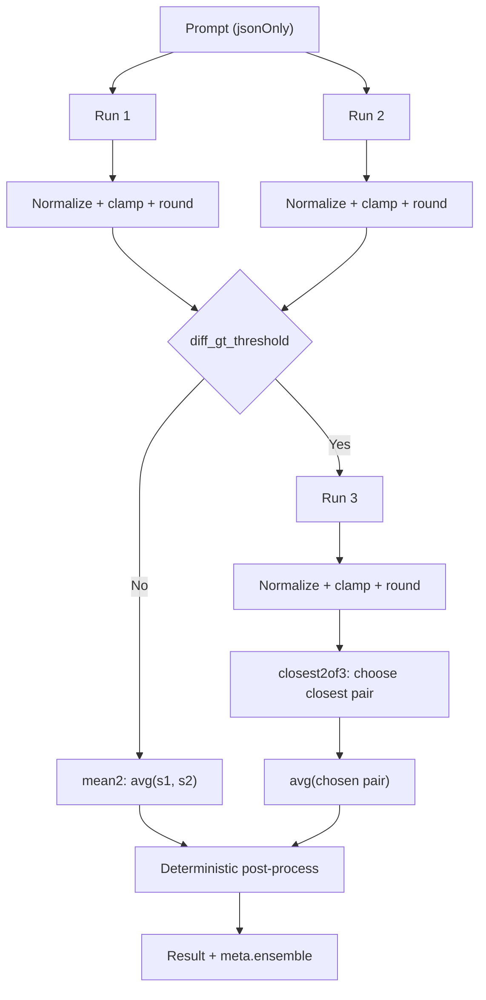
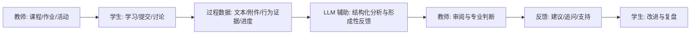
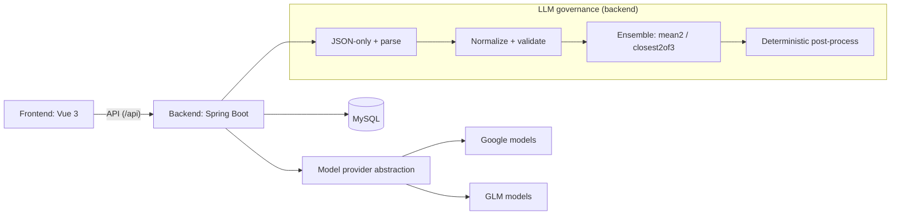

<div align="center">
  
  <h1>基于大语言模型的学生核心能力培养评估系统</h1>
  <p>
    核心卖点：LLM 稳定性控制 · 结构化输出治理 · 可部署全栈系统
  </p>
  <p>
    <a href="#quickstart">快速开始</a>
    · <a href="#engineering">工程优势</a>
    · <a href="#how-it-works">工作流</a>
    · <a href="#architecture">架构</a>
    · <a href="#docs">文档</a>
    · <a href="#philosophy">理念（场景）</a>
  </p>
  <p>
    
    
    
    
    
  </p>
</div>


## 一句话概述

这是一个围绕 **LLM 不稳定性** 与 **结构化输出可控性** 做“工程化治理”的全栈系统，并将这套模式落地到形成性评价场景（教师批改、行为洞察、口语训练）。

如果你关注 AI 工程落地而不是教育场景本身：请直接看「工程优势」与对应代码/文档链接。

<a id="engineering"></a>

## 工程优势（Engineering-Oriented Summary）

### 1) LLM 可靠性工程（variance/cost tradeoff）

将 LLM 视为“有方差的上游”，通过后端稳定化算法让结果可追溯、可复现、成本可控：

- **稳定化管线（示意）**：



- **多次采样稳定机制**：默认 2 次取样，分差超过阈值（默认 `0.8`）触发第 3 次。见 `backend/src/main/java/com/noncore/assessment/service/ai/AiGradingEnsembler.java`。
- **closest2of3（最近对平均）**：三次取样时选出分差最小的两次求平均，抑制离群值。
- **统一四舍五入与范围控制**：所有关键分数统一 round 到 `0.1`，并 clamp 到 `0~5`。见 `backend/src/main/java/com/noncore/assessment/service/ai/AiGradingNormalizer.java`。
- **可观测性**：聚合结果附带 `meta.ensemble`（chosenPair、pairDiff、confidence、runs…），便于前端解释与排障。见 `docs/backend/api/ai-grading.md`。
- **流式体验**：提供 SSE 逐次取样接口，避免多次取样导致的等待/超时体验问题。见 `backend/src/main/java/com/noncore/assessment/controller/AiController.java`（`/ai/grade/essay/stream`）。

### 2) Structured Output Governance（把 JSON 当“不可靠上游”）

通过“JSON contract + 解析校验 + 归一化/补齐”的后端治理，避免 demo 级“解析失败就崩”：

- **强制 JSON-only 批改** + **INVALID_JSON 降级**：解析失败不污染下游，统一返回错误结构并保留 raw 便于排障。见 `docs/backend/api/ai-grading.md` 与 `backend/src/main/java/com/noncore/assessment/controller/AiController.java`。
- **结构归一化**：兼容多种模型输出（标准结构 / `evaluation_result[]` / `evaluation{}`），最终统一为标准结构供前端渲染。见 `backend/src/main/java/com/noncore/assessment/service/ai/AiGradingNormalizer.java`。
- **越权防护（行为洞察不算分）**：行为洞察 AI 输出若包含常见评分/权重字段则拒绝；同时对 `evidenceIds` 做白名单校验（必须来自阶段一摘要），并对缺失维度补齐“证据不足”。见 `backend/src/main/java/com/noncore/assessment/service/impl/BehaviorInsightGenerationServiceImpl.java` 与 `docs/backend/api/behavior.md`。

### 3) 确定性后处理管线（Deterministic Post-Processing）

将生成式输出进一步“确定化”，降低文本抖动与结构漂移：

- **子项分数均值计算**：只对最终 chosen pair 做均值计算，并重新计算 `overall.dimension_averages/final_score`，避免不一致。
- **evidence 去重合并（按 quote）**：对子项证据按 quote 弱规范化去重，每子项最多保留 3 条。
- **suggestions 去重与上限**：弱规范化去重，每子项最多保留 5 条；整体反馈最多取 6 条建议。
- **holistic_feedback 模板化生成**：不拼接模型原文，后端生成确定性总结，避免“二次抖动”。见 `backend/src/main/java/com/noncore/assessment/service/ai/AiGradingEnsembler.java`。

### 4) 多 Agent / 多职责拆分（contract-first）

不同任务拆分不同“角色”，用结构化 contract 隔离职责，避免单 prompt 一把梭：

- **作文批改 Agent**：结构化评分 + 稳定化聚合（`/ai/grade/*`）。
- **行为洞察 Agent**：证据驱动、无分数、带治理与缓存（`/behavior/insights/*`）。
- **口语训练 Agent（可选）**：turn-based 输出与实时语音交互（见 `agent-server/` 与 `docs/frontend/voice-practice.md`）。

### 5) 可部署系统设计（Production-Oriented）

- 后端：Java 17 + Spring Boot，REST API（统一前缀 `/api`），Swagger。
- 前端：Vue 3 + Vite，按角色路由拆分；文档站：VitePress。
- 数据：MyBatis + MySQL。
- 模型抽象：通过 provider/env 配置切换模型（如 `google/*`、`glm-*`），并支持代理配置。见「配置」。

### 6) 可迁移工程模式（不绑定教育）

这套模式可迁移到：LLM 客服、内容审核/合规、智能助理、RAG+多模型融合等。核心可复用能力在于：

- 不稳定模型的稳定化（sampling/ensemble/可观测）
- 结构化输出治理（contract + 校验 + 降级）
- 多 Agent 协作与职责隔离（接口契约）

<a id="philosophy"></a>

## 理念

> 这项工作关注的不是“AI 自动打分”，而是如何借助大语言模型，更好地支持形成性评价。
> 系统并不是要改变课堂原有的教学结构，而是尝试把评价、反馈和能力观察，自然嵌入到教师已经熟悉的教学流程中。
> AI 在其中承担的是支持性角色，帮助教师更系统地理解学生的学习过程，而不是替代教师的专业判断。

我们希望实现：

- 课堂评价从“给结果”回到“理解过程”。
- 教师得到更系统的观察线索与结构化反馈，但保留专业判断的主导权。
- 学生能看到自己平时不易察觉的能力与策略，并获得可执行的改进建议。

<a id="abilities"></a>

## 能力框架

系统关注的核心能力维度（可扩展）：

- 道德（价值取向、责任意识、学术诚信等）
- 学习态度（投入度、坚持性、自我调节等）
- 学习策略（目标设定、计划与监控、反思策略等）
- 学习方法（信息加工、练习方式、知识迁移等）

<a id="how-it-works"></a>

## 工作流（系统如何工作）



LLM 产出的定位：

- 给出“可解释的线索”和“可行动的建议”。
- 不替代教师评分或决策。
- 强调对学习过程的理解与支持。

## 功能概览

- 学生端：课程学习、作业提交、成绩与能力分析、通知与社区、AI 助手、实时语音口语练习。
- 教师端：课程/作业管理、批改评分、学生画像与分析、AI 批改与反馈辅助。
- 管理员端：人员管理、课程治理、社区治理、能力报告、数据导出与审计。

<a id="quickstart"></a>

## 快速开始

### 1) 环境要求

- Node.js 18+（建议 20+）
- Java 17
- Maven 3.8+
- MySQL 8.x

### 2) 初始化数据库

```bash
mysql -u root -p
CREATE DATABASE student_assessment_system CHARACTER SET utf8mb4 COLLATE utf8mb4_unicode_ci;

# 导入主结构
mysql -u root -p student_assessment_system < backend/src/main/resources/schema.sql

# 可选：示例数据
mysql -u root -p student_assessment_system < backend/src/main/resources/data.sql
```

### 3) 启动后端

```bash
cd backend
mvn spring-boot:run
```

- API 根路径：`http://localhost:8080/api`
- Swagger UI：`http://localhost:8080/api/swagger-ui.html`
- AI 功能：需先在「配置」中设置 `AI_DEFAULT_PROVIDER` 与对应的 `*_API_KEY`

### 4) 启动前端（同时启动文档站）

```bash
cd frontend
npm install
npm run dev
```

- 前端：`http://localhost:5173`
- 文档站（本地）：`http://localhost:4174`

<a id="config"></a>

## 配置

### 后端（`backend/src/main/resources/application.yml`）

- 数据库：`DB_HOST` `DB_PORT` `DB_NAME` `DB_USERNAME` `DB_PASSWORD`
- JWT：`JWT_SECRET` `JWT_EXPIRATION` `JWT_REFRESH_EXPIRATION`
- AI：`AI_DEFAULT_PROVIDER` `GOOGLE_API_KEY` `GOOGLE_API_BASE_URL` `GLM_API_KEY` `GLM_API_BASE_URL`
- AI 代理：`AI_PROXY_*`

### 前端

- `VITE_API_BASE` / `VITE_API_BASE_URL`：API 基地址（会自动补齐 `/api`）
- `VITE_BACKEND_URL`：开发代理目标（默认 `http://localhost:8080`）
- `VITE_DOCS_URL`：生产环境文档跳转地址

<a id="architecture"></a>

## 架构

- 前端：Vue SPA（按角色路由分组）
- 后端：Spring Boot REST API（统一前缀 `/api`）
- 文档：VitePress



代码层级（简）：

```text
Frontend: View -> Store(Pinia) -> API(Axios)
Backend:  Controller -> Service -> Mapper(MyBatis) -> MySQL
```

<a id="docs"></a>

## 文档

- 新手导航：`docs/README.md`
- 文档首页：`docs/index.md`
- 后端 API 参考：`docs/backend/api/index.md`
- AI 批改稳定化：`docs/backend/api/ai-grading.md`
- 行为洞察（两阶段/治理）：`docs/backend/api/behavior.md`
- 前端 API 参考：`docs/frontend/api/index.md`
- 实时语音口语训练：`docs/frontend/voice-practice.md`

## 项目结构

```text
.
├── frontend/         # Vue 3 + Vite
├── backend/          # Spring Boot (Java 17)
├── docs/             # VitePress
└── agent-server/     # 语音 Agent 相关（可选）
```

## 安全与隐私

- 不要把真实敏感数据（个人隐私、身份证号、手机号等）直接投喂给 LLM。
- 生产环境通过环境变量注入密钥与数据库配置，避免写入仓库。
- 结合组织要求制定数据保留、脱敏与审计策略。

## 项目事实

更新时间：2026-02-26

- 前端版本：`frontend/package.json` -> `0.3.7`
- 后端版本：`backend/pom.xml` -> `1.0.5`
- 前端视图（`*View.vue`）：54
- 后端 Controller：38
