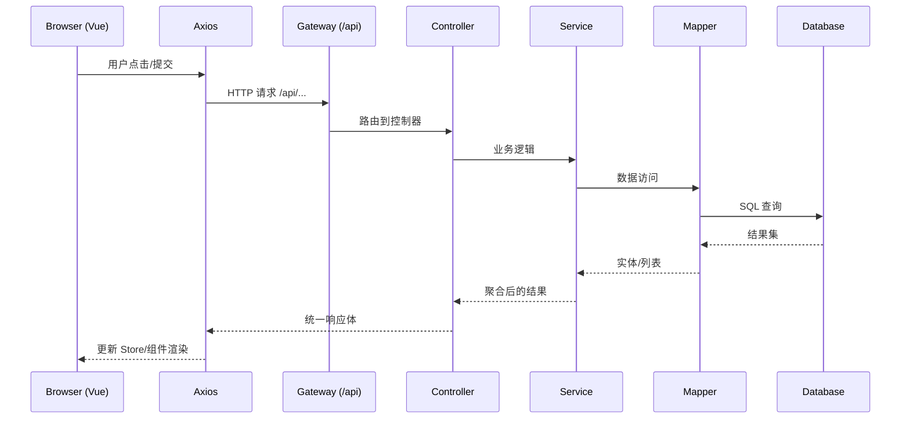

# 架构总览（Architecture Overview）

目标：用一条“从浏览器到数据库”的请求链路，解释系统是如何工作的。

## 1. 一次请求的生命周期
1) 浏览器在前端页面（Vue）中发起操作
2) 通过 Axios 向 `VITE_API_BASE_URL + /api/...` 发送请求
3) Vite 开发环境下，`/api` 也可被代理到 `http://localhost:8080`
4) 后端接收请求（`/api/**`，Spring MVC Controller）
5) Service 处理业务逻辑，调用 Mapper（MyBatis）访问数据库
6) 数据库返回结果 → Service 聚合 → Controller 统一返回体
7) 前端接收响应，更新 Pinia Store → 组件渲染

## 2. 鉴权与会话（JWT）
- 登录成功后，前端保存 `token`（本地存储）
- 之后的请求在 `Authorization: Bearer <token>` 头中携带令牌
- 后端 `JwtAuthenticationFilter` 解析并验证，放行或返回 401
- 前端收到 401 将自动跳到登录页

## 3. 目录与职责（后端）
- `controller/`：接收请求、参数校验、调用服务、返回统一响应
- `service/`：业务逻辑层；`impl/` 为实现类
- `mapper/` 与 `resources/mapper/*.xml`：数据库访问
- `entity/`、`dto/`：实体与数据传输对象
- `config/`：安全、JWT、Redis、Swagger、全局配置
- `exception/`：全局异常与错误码
- `util/`：工具类（分页、响应封装、JWT 等）

## 4. 目录与职责（前端）
- `api/`：与后端 Controller 一一对应的请求封装
- `stores/`：Pinia 全局状态，承载业务流程
- `features/`：按业务域/角色组织的页面与组件
- `layouts/`：页面骨架（学生/教师）
- `router/`：路由与守卫
- `types/`：与后端 DTO 对齐的 TypeScript 类型
- `utils/`：通用工具（含 API 处理）

## 5. 可视化（Mermaid）

## 6. 类型与契约
- 后端通过 SpringDoc 暴露 OpenAPI；Swagger UI 可交互调试
- 前端 `types/` 依据后端 DTO 定义，尽量保持字段与约束一致

## 7. AI 与可选能力
- `/ai` 相关接口由 `AiController` 提供
- 通过 `AI_DEFAULT_PROVIDER`、`OPENROUTER_API_KEY`/`DEEPSEEK_API_KEY` 启用

## 8. 安全配置概览（与代码一致）

- CORS：允许本地开发来源（localhost/127.0.0.1/0.0.0.0:5173 等），预检 `OPTIONS /**` 放行
- Headers：为支持 PDF IFrame 预览，`X-Frame-Options` 在后端被关闭（生产请限制可信域）
- 公共 URL：`/auth/**`、`/users/forgot-password`、`/users/reset-password`、`/users/email/change/confirm` 等放行，其余走鉴权
- 详见：`docs/security-config.md`

---

## 9. 首个 PR 计划（First PR Plan）
- 题目：实现“通知中心会话模式”或“文件预览”小功能（二选一）
- 步骤：
  1) 在 `docs/cookbook.md` 对应任务下列出实现清单
  2) 后端先确认/补齐端点，再实现前端视图与 Store
  3) 自测：按 E2E 时序图走通；补充 FAQ 条目（如遇到新问题）
  4) 更新文档：API 页、前端 API 页、Conventions/Glossary 如有新增
  5) 提交 PR：按照提交规范与评审清单

## 10. PR 检查清单（Checklist）
- [ ] 构建通过（后端 Maven、前端 Type Check/Lint）
- [ ] Swagger 可用，新增/修改端点能调
- [ ] 页面可用，401/403/404 处理清晰
- [ ] 文档更新（API/FAQ/术语/Conventions/E2E 如涉及）
- [ ] i18n 文案完整（中英）
- [ ] 安全检查（无敏感信息泄漏、鉴权与参数校验到位）
- [ ] 回滚策略说明
