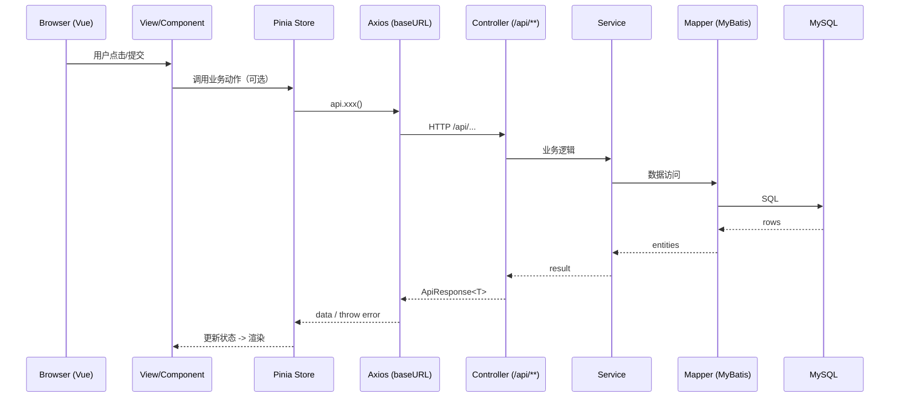

# 架构总览（Architecture Overview）

## 目标（Goal）

用一条“从浏览器到数据库”的请求链路，解释系统如何工作，并知道遇到问题该去哪里定位。

## 一次请求的生命周期（Request Lifecycle）

1. 浏览器在前端页面（Vue）中发起操作（点击/提交）。
2. 组件或 Store 调用 `frontend/src/api/*.ts`，最终走到 Axios（`frontend/src/api/config.ts`）。
3. Axios 的 `baseURL` 规则：
   - 优先使用 `VITE_API_BASE` 或 `VITE_API_BASE_URL`（会自动补齐 `/api`）
   - 未配置则默认走相对路径 `/api`（同源部署或本地代理）
4. 开发环境下，Vite 会把 `/api` 代理到后端（见 `frontend/vite.config.ts`，默认 `http://localhost:8080`）。
5. 后端实际挂载在 `context-path=/api`（见 `backend/src/main/resources/application*.yml`），Controller 接收请求。
6. Service 处理业务逻辑，调用 Mapper（MyBatis）访问 MySQL。
7. Service 返回结果 -> Controller 统一包装 `ApiResponse<T>` -> 前端渲染并更新状态。

## 可视化（Mermaid）

```mermaid
sequenceDiagram
  participant B as Browser (Vue)
  participant V as View/Component
  participant P as Pinia Store
  participant A as Axios (baseURL)
  participant C as Controller (/api/**)
  participant S as Service
  participant M as Mapper (MyBatis)
  participant D as MySQL

  B->>V: 用户点击/提交
  V->>P: 调用业务动作（可选）
  P->>A: api.xxx()
  A->>C: HTTP /api/...
  C->>S: 业务逻辑
  S->>M: 数据访问
  M->>D: SQL
  D-->>M: rows
  M-->>S: entities
  S-->>C: result
  C-->>A: ApiResponse<T>
  A-->>P: data / throw error
  P-->>V: 更新状态 -> 渲染
```

## 鉴权与会话（JWT）

- 登录成功后，前端保存 `token`（localStorage）。
- 之后请求统一携带 `Authorization: Bearer <token>`（在 `frontend/src/api/config.ts` 拦截器里注入）。
- 后端 `JwtAuthenticationFilter` 解析并验证 token，放行或返回 401。
- 前端收到 401 会清理 token，并跳转到 `/auth/login`（避免在 `/auth/*` 内来回跳）。

## 目录与职责（后端）

- `backend/src/main/java/com/noncore/assessment/controller/*`：接收请求、校验、返回统一响应。
- `backend/src/main/java/com/noncore/assessment/service/*`：业务逻辑；`impl/` 为实现。
- `backend/src/main/java/com/noncore/assessment/mapper/*` + `backend/src/main/resources/mapper/*.xml`：数据库访问。
- `backend/src/main/java/com/noncore/assessment/entity/*`、`dto/*`：实体与传输对象。
- `backend/src/main/java/com/noncore/assessment/config/*`：安全、JWT、全局配置、AI 配置等。
- `backend/src/main/java/com/noncore/assessment/exception/*`：业务异常与全局异常处理。
- `backend/src/main/java/com/noncore/assessment/util/*`：工具类（分页、响应封装、JWT 等）。

## 目录与职责（前端）

- `frontend/src/api/*`：请求封装（与后端域/控制器对齐）。
- `frontend/src/stores/*`：Pinia 状态与业务流程。
- `frontend/src/features/*`：按角色/业务域组织的页面与组件。
- `frontend/src/layouts/*`：页面骨架（学生/教师/管理员/公共）。
- `frontend/src/router/*`：路由表与守卫。
- `frontend/src/types/*`：TypeScript 类型（尽量与后端返回对齐）。

## 类型与契约（Contract）

- 后端通过 SpringDoc 暴露 OpenAPI；本地 Swagger：`http://localhost:8080/api/swagger-ui.html`
- 文档优先级：Swagger/代码 > docs；docs 负责说明“怎么用 + 常见坑 + 设计约束”

## 实时与 AI（可选能力）

- 通知 SSE：`GET /api/notifications/stream`（见 `/backend/api/notification`）
- AI 聊天与会话：`/api/ai/*`（见 `/backend/api/ai`）
- AI 批改：`/api/ai/grade/*`（见 `/backend/api/ai-grading`）
- AI 口语训练：`/api/ai/voice/*` 与 `POST /api/ai/voice/turns`（见 `/backend/api/ai-voice-practice`）

AI provider 默认走 `google`（可用 `AI_DEFAULT_PROVIDER` 覆盖），密钥从环境变量注入（详见 `backend/src/main/resources/application.yml` 的 `ai.*`）。

## 安全配置概览

- CORS：本地默认放行 `http://localhost:5173`（见 `security.cors.allowed-origins`）
- 公共 URL：`/auth/login`、`/auth/register`、Swagger 等在白名单，其余需要鉴权
- 详见：`/security-config`

## 首个 PR 建议（可选）

选一个 “小而完整” 的闭环任务（建议从 `/cookbook` 中挑一个），并同时更新对应 API 文档与交互文档，确保后续不会过期。 
