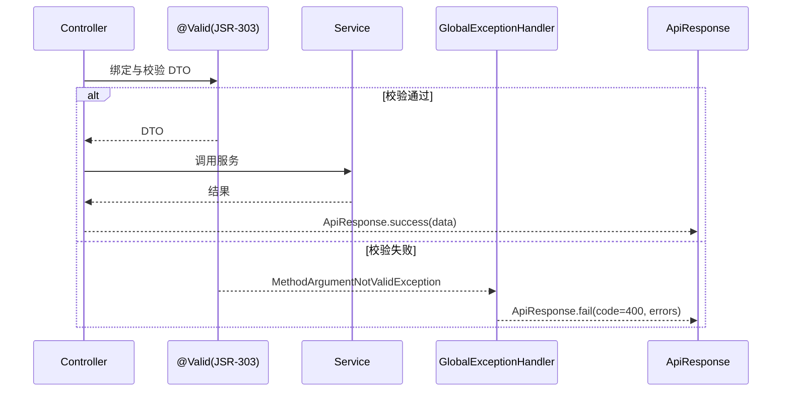
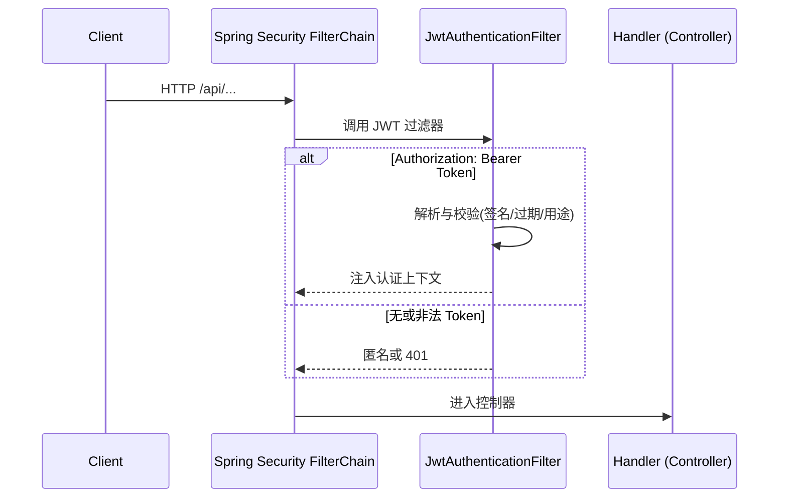
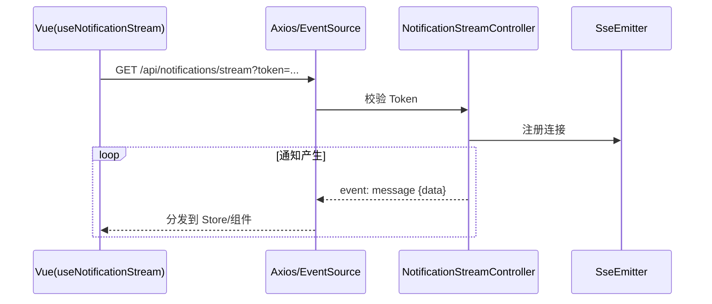
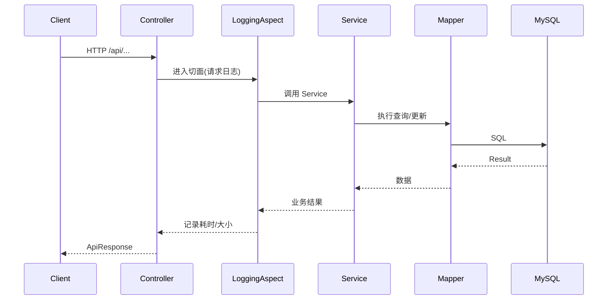

# 后端深度讲解（Backend Deep Dive）

面向新手，带你从配置到分层实现逐步理解后端。

## 1. 运行环境与入口
- Java 17、Spring Boot 3.5.4
- 入口类：`src/main/java/com/noncore/assessment/AssessmentApplication.java`
  - 注解：`@SpringBootApplication`、`@EnableCaching`、`@MapperScan("com.noncore.assessment.mapper")`
  - 启动后打印：Swagger 与健康检查地址（context-path 为 `/api`）

## 2. 关键配置（application.yml 精读）
- 端口/上下文：`server.port=8080`、`server.servlet.context-path=/api`
- 数据源：`DB_HOST/DB_PORT/DB_NAME/DB_USERNAME/DB_PASSWORD`
- Redis（可选）：`REDIS_HOST/PORT/PASSWORD`
- JWT：`JWT_SECRET`、过期时间与刷新过期
- 上传：目录、大小与扩展名
- SpringDoc：`/v3/api-docs`、`/swagger-ui.html`
- CORS 放行清单与无需鉴权的公共 URL
- AI：`AI_DEFAULT_PROVIDER`、`OPENROUTER_API_KEY/DEEPSEEK_API_KEY`、`DEEPSEEK_MODEL`

## 3. 分层与职责
- Controller：参数校验、鉴权入口、调用 Service、返回统一响应体
- Service：业务逻辑与事务边界，组织调用 Mapper 与其它服务
- Mapper：MyBatis 接口，配合 `resources/mapper/*.xml` 执行 SQL
- DTO/Entity：输入/输出与持久化模型
- Config：安全、JWT、Redis、Swagger、全局配置
- Exception：全局异常处理与错误码
- Util：分页、响应、JWT、敏感词等工具

## 4. 统一返回与异常
- 统一返回：`ApiResponse<T>`（`code/message/data`）
- 分页：`PageResult<T>`
- 全局异常：`GlobalExceptionHandler`

## 5. 典型用例：新增一个分页查询接口
1) DTO 与校验规则：`dto/request`、`@Valid`
2) Controller：定义 `@GetMapping("/xxx")`、解析分页参数
3) Service：封装分页逻辑与业务规则
4) Mapper + XML：编写 SQL 与可选动态条件
5) 返回：使用 `PageResult<T>` 与 `ApiResponse.success(data)`

## 6. AI 集成最小示例
- 控制器：`AiController` 暴露 `/ai/chat`、会话管理、消息记录
- 服务：`AiService` 根据请求上下文生成回答
- 客户端：`service/llm/DeepseekClient`（以 OpenRouter/DeepSeek 为例）
- 环境变量：`AI_DEFAULT_PROVIDER`、`OPENROUTER_API_KEY/DEEPSEEK_API_KEY`、`DEEPSEEK_MODEL`

## 7. 重点实现文件导览（示例）
- `controller/AiController.java`：AI 聊天与会话/记忆管理
- `service/impl/CourseServiceImpl.java`：课程核心业务
- `service/impl/StudentAnalysisServiceImpl.java`：学生能力分析
- `service/impl/DashboardServiceImpl.java`：仪表盘指标
- `service/llm/DeepseekClient.java`：LLM 客户端
- `util/JwtUtil.java`：JWT 生成/解析/刷新

## 8. 数据库初始化
```bash
mysql -u root -p
CREATE DATABASE student_assessment_system CHARACTER SET utf8mb4 COLLATE utf8mb4_unicode_ci;
mysql -u root -p student_assessment_system < src/main/resources/schema.sql
# 可选：初始数据（当前非最新）
mysql -u root -p student_assessment_system < src/main/resources/data.sql
```

## 9. 调试建议
- 开启日志级别（`logging.level.com.noncore.assessment=DEBUG`）
- 用 Swagger 先打通接口再接前端
- 关注 401/403：JWT、CORS、公共 URL 放行配置

---

## 10. 请求校验与异常链路

要点：
- 在 DTO 上使用 `@NotNull/@Size/@Pattern` 等；必要时自定义校验器
- 错误信息统一由 `GlobalExceptionHandler` 转换为标准响应体

## 11. 安全过滤器链（JWT）

要点：
- 公共端点（如登录/注册/静态资源）在 `SecurityConfig` 放行
- 其余端点默认要求 `isAuthenticated()` 或角色

## 12. 实时通知（SSE）
- 控制器：`NotificationStreamController` 暴露 `GET /api/notifications/stream`（`text/event-stream`）
- 鉴权：支持 `Authorization: Bearer <token>` 或查询参数 `?token=`
- 连接：校验通过后注册 `SseEmitter`，服务端按事件推送



## 13. 事务与一致性边界
- 规则：只在 Service 层使用 `@Transactional`
- 写多表：同一事务内保证原子性；跨服务调用用“补偿”或事件
- 幂等性：对外部回调/重复提交使用业务唯一键或 token 防重

## 14. 跨模块关系图
```mermaid
graph LR
  UI[Vue Components] --> API[Axios API Layer]
  API --> CTRL[Spring MVC Controller]
  CTRL --> SVC[Service(@Transactional)]
  SVC --> MAP[MyBatis Mapper]
  MAP --> DB[(MySQL)]
  SVC --> REDIS[(Redis Cache)]
  SVC --> LLM[DeepseekClient]
  CTRL -.SSE.-> ClientSSE[Notification Stream]
```

## 15. 性能与扩展建议
- 分页：统一使用 `PageResult<T>`，避免一次性拉取大数据
- 缓存：热点统计可引入 Redis（注意失效与一致性）
- 慢查询：合理索引与 SQL 审核；必要时读写分离
- 限流：按用户/IP 维度；SSE 连接数限制
- 日志：关键路径埋点，异常堆栈与上下文参数采样记录

## 16. AOP 日志与审计
利用 Spring AOP 统一记录关键调用链与异常，降低重复样板代码：
- 入口：Controller 层切面，记录 `uri/method/userId/参数`
- 出口：返回体大小/耗时；异常统一转标准错误响应



要点：
- 切点精准（Controller 包），避免多次记录
- 屏蔽敏感字段（密码/Token）
- 大响应体采样记录，避免日志爆量

## 17. 分页与动态 SQL（MyBatis + PageHelper）
- 统一查询参数：`page/size/sort`，排序字段进行白名单校验，防止 SQL 注入
- 动态 SQL：使用 `<if>`/`<where>`/`<trim>` 生成可选条件
- PageHelper：在 Service 层启动分页，返回 `PageResult<T>`
- N+1 规避：尽可能在 SQL 层联表或批量查询

## 18. 缓存策略（Spring Cache + Redis）
- 读多写少：`@Cacheable` 命中缓存；更新时 `@CacheEvict` 或 `@CachePut`
- Key 设计：`实体:主键`、`列表:条件摘要`；注意 TTL 与雪崩/穿透/击穿
- 失效策略：写路径统一在 Service 层集中失效，保持一致性

## 19. 错误码与异常映射
- 成功：`code=200`
- 参数/校验：`400`
- 鉴权：`401`，权限：`403`
- 资源不存在：`404`
- 冲突/状态非法：`409`
- 服务器错误：`5xx`
全局由 `GlobalExceptionHandler` 统一包装为 `ApiResponse.fail(code,message)`。

## 20. 配置分环境与 Profiles
- `application.yml` 为通用；按需扩展 `application-dev.yml`、`application-prod.yml`
- 使用环境变量覆盖敏感/差异化配置（DB/JWT/AI/Redis）
- Maven Profile：`-Pdev/-Pprod` 管理构建差异
