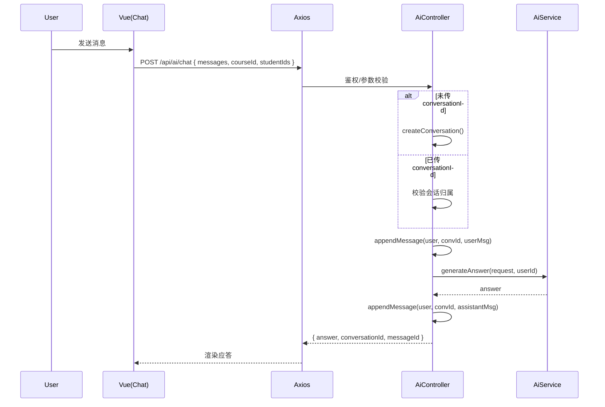

# AI 聊天与会话 API（AI）

> 以 Swagger 为准：`http://localhost:8080/api/swagger-ui.html`

## 1. 端点总览（与后端对齐）
- `POST /api/ai/chat`：AI 聊天（非流式）
- `POST /api/ai/conversations`：新建会话
- `GET /api/ai/conversations?q=&pinned=&archived=&page=&size=`：会话列表
- `PUT /api/ai/conversations/{id}`：更新会话（标题/置顶/归档）
- `DELETE /api/ai/conversations/{id}`：删除会话
- `GET /api/ai/conversations/{id}/messages?page=&size=`：会话消息列表
- `GET /api/ai/memory`：获取用户记忆
- `PUT /api/ai/memory`：更新用户记忆

---

## 2. 聊天（自动建会话）
- 请求（chat）：
```bash
curl -H "Authorization: Bearer $TOKEN" -H "Content-Type: application/json" \
  -d '{
    "messages": [ { "role": "user", "content": "请按作业 3001 的评分标准给出建议" } ],
    "courseId": 2001,
    "studentIds": [1001],
    "model": "deepseek/deepseek-chat-v3.1",
    "provider": "openrouter"
  }' \
  http://localhost:8080/api/ai/chat
```
### 多模态示例（图片输入：Gemini）
```bash
curl -H "Authorization: Bearer $TOKEN" -H "Content-Type: application/json" \
  -d '{
    "messages": [ { "role": "user", "content": "请描述图片" } ],
    "model": "google/gemini-2.5-flash-image-preview:free",
    "attachmentFileIds": [12345]
  }' \
  http://localhost:8080/api/ai/chat
```
说明：后端会将 `attachmentFileIds` 转换为 OpenAI 兼容消息结构中的 `image_url`，通过统一下载接口注入到最后一条用户消息。

### 其他模型示例（OpenAI: gpt-oss-120b）
```bash
curl -H "Authorization: Bearer $TOKEN" -H "Content-Type: application/json" \
  -d '{
    "messages": [ { "role": "user", "content": "请总结这段文本的要点" } ],
    "model": "openai/gpt-oss-120b:free"
  }' \
  http://localhost:8080/api/ai/chat
```
- 成功响应：
```json
{
  "code": 200,
  "data": {
    "answer": "这里是基于作业评分标准和学生画像的建议...",
    "conversationId": 7777,
    "messageId": 8888
  }
}
```
- 说明：未传 `conversationId` 时，后端会自动创建会话，标题取最近一条用户消息的前缀（最多 20 字符）。若传入 `conversationId`，会校验归属后直接写入消息并生成应答。

---

## 3. 会话管理
- 创建会话：
```bash
curl -H "Authorization: Bearer $TOKEN" -H "Content-Type: application/json" \
  -d '{ "title": "班级分析", "model": "deepseek/deepseek-chat-v3.1", "provider": "openrouter" }' \
  http://localhost:8080/api/ai/conversations
```
- 会话列表：
```bash
curl -H "Authorization: Bearer $TOKEN" \
  "http://localhost:8080/api/ai/conversations?q=分析&pinned=&archived=&page=1&size=10"
```
- 更新会话：
```bash
curl -X PUT -H "Authorization: Bearer $TOKEN" -H "Content-Type: application/json" \
  -d '{ "title": "班级分析-期中", "pinned": true, "archived": false }' \
  http://localhost:8080/api/ai/conversations/7777
```
- 删除会话：
```bash
curl -X DELETE -H "Authorization: Bearer $TOKEN" \
  http://localhost:8080/api/ai/conversations/7777
```
- 消息列表：
```bash
curl -H "Authorization: Bearer $TOKEN" \
  "http://localhost:8080/api/ai/conversations/7777/messages?page=1&size=50"
```

---

## 4. 用户记忆
- 获取：
```bash
curl -H "Authorization: Bearer $TOKEN" \
  http://localhost:8080/api/ai/memory
```
- 更新：
```bash
curl -X PUT -H "Authorization: Bearer $TOKEN" -H "Content-Type: application/json" \
  -d '{ "enabled": true, "content": "我的授课偏好：更注重能力成长..." }' \
  http://localhost:8080/api/ai/memory
```
- 成功响应：
```json
{ "code": 200, "data": { "enabled": true, "content": "..." } }
```

---

## 5. 返回码对照
- 200：成功
- 400：参数非法（空消息、`studentIds` 超过上限 5 等）
- 401：未认证
- 403：无权操作（会话不属于当前用户等）
- 429/5xx：上游模型限流/错误或服务异常

---

# 前端对接（ai.api.ts）
- `chat(data)` ↔ `POST /api/ai/chat`
- `createConversation(data)` / `listConversations(params)` / `updateConversation(id, data)` / `removeConversation(id)`
- `listMessages(id, params)`
- `getMemory()` / `updateMemory(data)`

## 配置
- `AI_DEFAULT_PROVIDER`（默认 `openrouter`）
- `OPENROUTER_API_KEY` 或 `DEEPSEEK_API_KEY`
- `DEEPSEEK_MODEL`（默认 `deepseek/deepseek-chat-v3.1`）
- `GOOGLE_API_KEY`（使用 Gemini 时）

### 系统 Prompt 来源与覆盖
- 后端每次调用大模型前，会自动从 `ai.system-prompt-path` 指定的位置读取系统 Prompt 并作为 `system` 消息注入。
- 默认路径：`classpath:/prompts/essay_evaluation_system_prompt.txt`，可通过环境变量 `AI_SYSTEM_PROMPT_PATH` 覆盖为任意文件路径或类路径资源（支持 `classpath:` 前缀）。
- 要求：Prompt 请使用英文维护；文件使用 UTF-8 编码；修改后无需重启即可生效（每次调用即时读取）。

### AI 批改接口

- 单篇文本批改（强制 JSON 输出）
  - `POST /api/ai/grade/essay`
  - 入参示例：
  ```json
  { "messages": [ { "role": "user", "content": "<essay text>" } ], "model": "deepseek/deepseek-chat-v3.1", "jsonOnly": true, "useGradingPrompt": true }
  ```
  - 返回：JSON 对象（按作文批改 schema）。

- 批量文本批改（强制 JSON 输出）
  - `POST /api/ai/grade/essay/batch`
  - 入参：同上数组形式；返回：JSON 对象数组。

- 按文件ID批量批改（自动抽取文档文本）
  - `POST /api/ai/grade/files`
  - 入参：
  ```json
  { "fileIds": [1,2,3], "model": "deepseek/deepseek-chat-v3.1", "jsonOnly": true, "useGradingPrompt": true }
  ```
  - 返回：
  ```json
  { "results": [ { "fileId": 1, "fileName": "essayA.docx", "result": { /* JSON 或 {text:"..."} */ }, "error": null } ] }
  ```
  - 说明：支持 txt/doc/docx/pdf（基于 Apache Tika），若抽取失败或上游返回非 JSON，将在对应项的 `error` 字段说明。

---

## 6. AI 批改历史（History）

> 教师可分页查看批改历史、查看详情并删除记录。与前端 `aiGradingApi` 一致。

- 列表（分页）：
  - `GET /api/ai/grade/history?q=&page=&size=`
  - 参数：
    - `q` 可选：按文件名/模型等模糊匹配
    - `page` 可选，默认 1
    - `size` 可选，默认 20，最大 100
  - 响应：`PageResult<AiGradingHistory>`（包含 `items`, `page`, `size`, `total`, `pages`）

- 详情：
  - `GET /api/ai/grade/history/{id}`
  - 响应：`AiGradingHistory`，含 `fileId`、`fileName`、`model`、`finalScore`、`rawJson` 等

- 删除：
  - `DELETE /api/ai/grade/history/{id}`
  - 兼容（部分环境禁用 DELETE）：`POST /api/ai/grade/history/{id}/delete`
  - 权限：`hasRole('TEACHER')`

### 返回示例（列表）
```json
{
  "code": 200,
  "data": {
    "items": [
      {
        "id": 101,
        "teacherId": 11,
        "fileId": 8888,
        "fileName": "essayA.docx",
        "model": "google/gemini-2.5-pro",
        "finalScore": 87.5,
        "createdAt": "2025-09-16T09:12:33"
      }
    ],
    "page": 1,
    "size": 20,
    "total": 32,
    "pages": 2
  }
}
```

### 返回示例（详情）
```json
{
  "code": 200,
  "data": {
    "id": 101,
    "teacherId": 11,
    "fileId": 8888,
    "fileName": "essayA.docx",
    "model": "google/gemini-2.5-pro",
    "finalScore": 87.5,
    "rawJson": "{\n  \"overall\": { \"final_score\": 87.5, ... },\n  \"dimensions\": [ ... ]\n}",
    "createdAt": "2025-09-16T09:12:33"
  }
}
```

---

## 7. 配置：Gemini（Google）

> 见 `application.yml` → `ai.providers.google`。生产环境请用环境变量注入。

- 关键键：
  - `GOOGLE_API_BASE_URL`（默认 `https://generativelanguage.googleapis.com`）
  - `GOOGLE_API_KEY`（必填）
- 建议模型：`google/gemini-2.5-pro`（与后端默认保持一致；也可由前端传入 `model` 覆盖）
- 代理/重试：参见 `ai.proxy.*` 与 `ai.retry.*`

示例（application.yml 片段）：
```yaml
ai:
  providers:
    google:
      base-url: ${GOOGLE_API_BASE_URL:https://generativelanguage.googleapis.com}
      api-key: ${GOOGLE_API_KEY:}
```

### 通用聊天（AI 助手）扩展参数

- `POST /api/ai/chat`
- 扩展参数：
  - `jsonOnly`（可选，布尔）：为 true 时请求上游以 `response_format=json_object` 返回结构化 JSON；失败时返回文本。
  - `useGradingPrompt`（可选，布尔）：为 true 时在会话前注入“作文批改”系统 Prompt；为 false 时不注入。
 - 说明：
  - 在“AI 助手”页面，这两个参数由前端开关控制；在“AI 批改作业”页面默认强制 `jsonOnly=true`、`useGradingPrompt=true`。

---

## 时序图：AI 聊天（自动建会话 + 记录消息）

