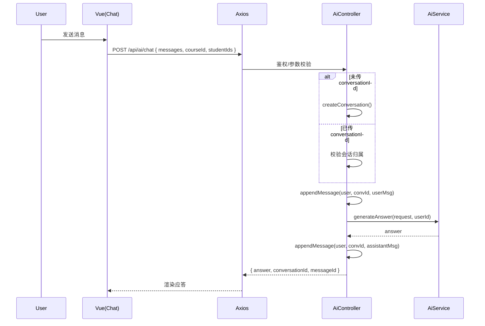

# AI 聊天与会话 API（AI）

> 以 Swagger 为准：`http://localhost:8080/api/swagger-ui.html`

## 1. 端点总览（与后端对齐）
- `POST /api/ai/chat`：AI 聊天（非流式）
- `POST /api/ai/conversations`：新建会话
- `GET /api/ai/conversations?q=&pinned=&archived=&page=&size=`：会话列表
- `PUT /api/ai/conversations/{id}`：更新会话（标题/置顶/归档）
- `DELETE /api/ai/conversations/{id}`：删除会话
- `GET /api/ai/conversations/{id}/messages?page=&size=`：会话消息列表
- `GET /api/ai/memory`：获取用户记忆
- `PUT /api/ai/memory`：更新用户记忆

---

## 2. 聊天（自动建会话）
- 请求（chat）：
```bash
curl -H "Authorization: Bearer $TOKEN" -H "Content-Type: application/json" \
  -d '{
    "messages": [ { "role": "user", "content": "请按作业 3001 的评分标准给出建议" } ],
    "courseId": 2001,
    "studentIds": [1001],
    "model": "deepseek/deepseek-chat-v3.1",
    "provider": "openrouter"
  }' \
  http://localhost:8080/api/ai/chat
```
### 多模态示例（图片输入：Gemini）
```bash
curl -H "Authorization: Bearer $TOKEN" -H "Content-Type: application/json" \
  -d '{
    "messages": [ { "role": "user", "content": "请描述图片" } ],
    "model": "google/gemini-2.5-flash-image-preview:free",
    "attachmentFileIds": [12345]
  }' \
  http://localhost:8080/api/ai/chat
```
说明：后端会将 `attachmentFileIds` 转换为 OpenAI 兼容消息结构中的 `image_url`，通过统一下载接口注入到最后一条用户消息。

### 其他模型示例（OpenAI: gpt-oss-120b）
```bash
curl -H "Authorization: Bearer $TOKEN" -H "Content-Type: application/json" \
  -d '{
    "messages": [ { "role": "user", "content": "请总结这段文本的要点" } ],
    "model": "openai/gpt-oss-120b:free"
  }' \
  http://localhost:8080/api/ai/chat
```
- 成功响应：
```json
{
  "code": 200,
  "data": {
    "answer": "这里是基于作业评分标准和学生画像的建议...",
    "conversationId": 7777,
    "messageId": 8888
  }
}
```
- 说明：未传 `conversationId` 时，后端会自动创建会话，标题取最近一条用户消息的前缀（最多 20 字符）。若传入 `conversationId`，会校验归属后直接写入消息并生成应答。

---

## 3. 会话管理
- 创建会话：
```bash
curl -H "Authorization: Bearer $TOKEN" -H "Content-Type: application/json" \
  -d '{ "title": "班级分析", "model": "deepseek/deepseek-chat-v3.1", "provider": "openrouter" }' \
  http://localhost:8080/api/ai/conversations
```
- 会话列表：
```bash
curl -H "Authorization: Bearer $TOKEN" \
  "http://localhost:8080/api/ai/conversations?q=分析&pinned=&archived=&page=1&size=10"
```
- 更新会话：
```bash
curl -X PUT -H "Authorization: Bearer $TOKEN" -H "Content-Type: application/json" \
  -d '{ "title": "班级分析-期中", "pinned": true, "archived": false }' \
  http://localhost:8080/api/ai/conversations/7777
```
- 删除会话：
```bash
curl -X DELETE -H "Authorization: Bearer $TOKEN" \
  http://localhost:8080/api/ai/conversations/7777
```
- 消息列表：
```bash
curl -H "Authorization: Bearer $TOKEN" \
  "http://localhost:8080/api/ai/conversations/7777/messages?page=1&size=50"
```

---

## 4. 用户记忆
- 获取：
```bash
curl -H "Authorization: Bearer $TOKEN" \
  http://localhost:8080/api/ai/memory
```
- 更新：
```bash
curl -X PUT -H "Authorization: Bearer $TOKEN" -H "Content-Type: application/json" \
  -d '{ "enabled": true, "content": "我的授课偏好：更注重能力成长..." }' \
  http://localhost:8080/api/ai/memory
```
- 成功响应：
```json
{ "code": 200, "data": { "enabled": true, "content": "..." } }
```

---

## 5. 返回码对照
- 200：成功
- 400：参数非法（空消息、`studentIds` 超过上限 5 等）
- 401：未认证
- 403：无权操作（会话不属于当前用户等）
- 429/5xx：上游模型限流/错误或服务异常

---

# 前端对接（ai.api.ts）
- `chat(data)` ↔ `POST /api/ai/chat`
- `createConversation(data)` / `listConversations(params)` / `updateConversation(id, data)` / `removeConversation(id)`
- `listMessages(id, params)`
- `getMemory()` / `updateMemory(data)`

## 配置
- `AI_DEFAULT_PROVIDER`、`OPENROUTER_API_KEY`、`DEEPSEEK_API_KEY`、`DEEPSEEK_MODEL`（见 `application.yml`）

---

## 时序图：AI 聊天（自动建会话 + 记录消息）

