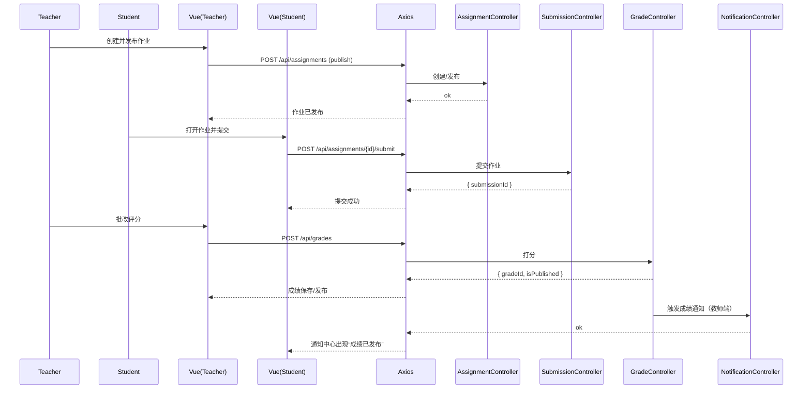

# 作业 API（Assignment）

> 以 Swagger 为准：`http://localhost:8080/api/swagger-ui.html`

## 1. 列表与检索
- `GET /api/assignments`：分页列表（支持 `courseId/teacherId/status/keyword/page/size/sort`）

## 2. CRUD
- `GET /api/assignments/{id}`：详情
- `POST /api/assignments`：创建（含截止时间 `dueDate` 格式 `yyyy-MM-dd HH:mm:ss`）
- `PUT /api/assignments/{id}`：更新
- `DELETE /api/assignments/{id}`：删除

## 3. 状态变更
- `POST /api/assignments/{id}/publish`：发布
请求：
```
POST /api/assignments/88/publish
Authorization: Bearer <token>
```
响应：
```json
{ "code": 200, "message": "OK" }
```

- `POST /api/assignments/{id}/close`：关闭

## 4. 统计与提醒
- `GET /api/assignments/{id}/submission-stats`：提交统计（已交/未交）
响应：
```json
{ "code":200, "data": { "assignmentId":"88","courseId":"2","totalEnrolled": 50, "submittedCount": 42, "unsubmittedCount": 8 } }
```

- `POST /api/assignments/{id}/remind-unsubmitted`：提醒未交（可携带 `message`）
请求：
```json
{ "message": "请尽快提交作业，截止今晚23:59" }
```

## 5. 返回码对照
- 200：成功
- 400：非法参数/截止时间格式不正确
- 401：未认证
- 403：非该课程教师操作
- 404：作业不存在
- 409：状态冲突（重复发布/关闭）
- 5xx：服务端错误

---

# 前端对接（assignment.api.ts）

## 1. 方法映射
- `getAssignments(params)` ↔ `GET /api/assignments`
- `getAssignmentsByCourse(courseId, params)` ↔ `GET /api/assignments?courseId=...`
- `getAssignmentById(id)` ↔ `GET /api/assignments/{id}`
- `createAssignment(data)` ↔ `POST /api/assignments`（内部归一 `dueDate` 格式）
- `updateAssignment(id, data)` ↔ `PUT /api/assignments/{id}`
- `deleteAssignment(id)` ↔ `DELETE /api/assignments/{id}`
- `publishAssignment(id)` ↔ `POST /api/assignments/{id}/publish`
- `closeAssignment(id)` ↔ `POST /api/assignments/{id}/close`
- `getAssignmentSubmissionStats(id)` ↔ `GET /api/assignments/{id}/submission-stats`
- `remindUnsubmitted(id, message?)` ↔ `POST /api/assignments/{id}/remind-unsubmitted`

## 2. 视图与 Store（示意）
- 教师端：`AssignmentSubmissionsView.vue` ↔ `useCourseStore/useTeacherStore` ↔ `assignment.api.ts`
- 学生端：`AssignmentSubmitView.vue` ↔ `useSubmissionStore` ↔ `assignment.api.ts`

## 3. 常见错误
- 400：截止时间格式不正确（请使用 `yyyy-MM-dd HH:mm:ss`）
- 401：未登录；403：非该课程教师操作

---

## 5. 时序图：布置 → 提交 → 评分 → 通知


## 6. curl 示例
创建作业：
```bash
curl -X POST 'http://localhost:8080/api/assignments' \
  -H 'Authorization: Bearer <access_jwt>' \
  -H 'Content-Type: application/json' \
  -d '{"courseId":2,"title":"HW1","dueDate":"2025-12-31 23:59:59"}'
```

发布作业：
```bash
curl -X POST 'http://localhost:8080/api/assignments/88/publish' \
  -H 'Authorization: Bearer <access_jwt>'
```

提醒未交：
```bash
curl -X POST 'http://localhost:8080/api/assignments/88/remind-unsubmitted' \
  -H 'Authorization: Bearer <access_jwt>' \
  -H 'Content-Type: application/json' \
  -d '{"message":"请尽快提交作业，截止今晚23:59"}'
```

## 7. 错误与排查
- 400 截止时间格式错误：确保使用 `yyyy-MM-dd HH:mm:ss`
- 401/403：确认登录状态与角色为授课教师
- 409 重复发布/关闭：检查当前作业状态后再操作
