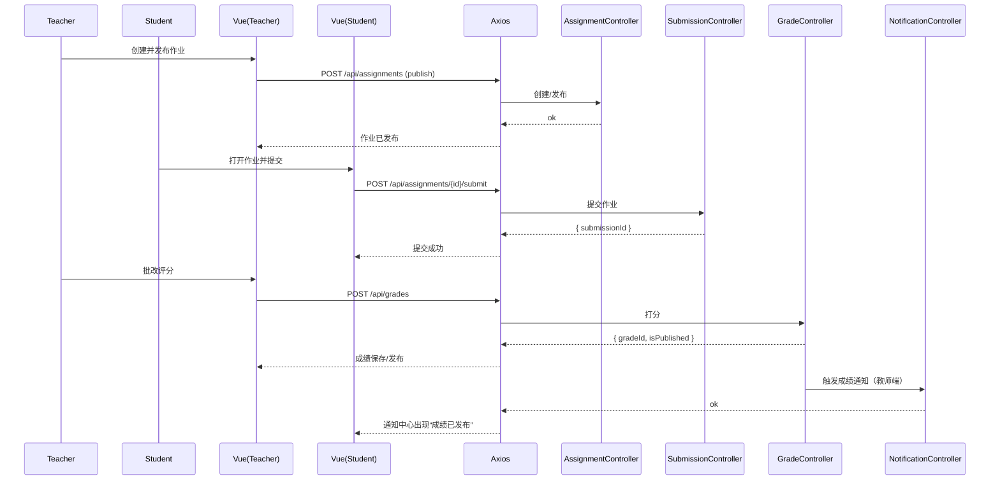

# 作业 API（Assignment）

> 以 Swagger 为准：`http://localhost:8080/api/swagger-ui.html`

## 0. 字段与约束（重要）
- assignment_type：作业类型
  - normal：普通作业（可有截止时间 due_date；禁止直接绑定 lesson_id）
  - course_bound：课程绑定-无截止（due_date 必须为空；允许绑定 lesson_id 到具体节次）
- lesson_id：仅当 assignment_type=course_bound 时允许设置/绑定。
- canSubmit 判定：course_bound 类型不受截止时间限制（始终视为未过期）；normal 类型遵循“未到截止或允许迟交”。

## 0.1 绑定接口与限制
- `PUT /api/assignments/{id}/lesson`：仅更新 lessonId（仅 course_bound 允许绑定），若为 normal 类型将返回 400。

## 0.2 迁移说明
- 为 `assignments` 新增：`assignment_type ENUM('normal','course_bound') NOT NULL DEFAULT 'normal'`；
- 允许 `due_date` 为空（TIMESTAMP NULL DEFAULT NULL）。
- 增加 `lesson_id BIGINT NULL` 外键到 `lessons(id)`，ON DELETE SET NULL。
- 索引：`idx_assignment_type(assignments.assignment_type)`，`idx_lesson_id(assignments.lesson_id)`。

---

## 1. 列表与检索
- `GET /api/assignments`：分页列表（支持 `courseId/teacherId/status/keyword/page/size/sort`，若需仅取可绑定类型，可在前端以 `assignment_type==='course_bound'` 过滤）

## 2. CRUD
- `GET /api/assignments/{id}`：详情
- `POST /api/assignments`：创建（含截止时间 `dueDate` 格式 `yyyy-MM-dd HH:mm:ss`；当 `assignmentType='course_bound'` 时不得携带 `dueDate`）
- `PUT /api/assignments/{id}`：更新（同上规则）
- `DELETE /api/assignments/{id}`：删除

## 3. 状态变更
- `POST /api/assignments/{id}/publish`：发布（状态从 `draft|scheduled` → `published`）
- `POST /api/assignments/{id}/close`：关闭（状态从 `published` → `closed`）

## 4. 统计与提醒
- `GET /api/assignments/{id}/submission-stats`：提交统计（已交/未交/已评分/未评分）
- `POST /api/assignments/{id}/remind-unsubmitted`：提醒未交（仅未过期 normal 或任意 course_bound）

## 5. 学生提交接口（位于 SubmissionController）
- `GET /api/assignments/{assignmentId}/submission`：获取当前学生对该作业的提交详情
- `POST /api/assignments/{assignmentId}/submit`：提交作业（JSON）
- `POST /api/assignments/{assignmentId}/draft`：保存草稿（表单）

---

# 前端对接（assignment.api.ts）

## 1. 方法映射
- `getAssignments(params)` ↔ `GET /api/assignments`
- `getAssignmentsByCourse(courseId, params)` ↔ `GET /api/assignments?courseId=...`
- `getAssignmentById(id)` ↔ `GET /api/assignments/{id}`
- `createAssignment(data)` ↔ `POST /api/assignments`（内部归一 `dueDate` 格式）
- `updateAssignment(id, data)` ↔ `PUT /api/assignments/{id}`
- `deleteAssignment(id)` ↔ `DELETE /api/assignments/{id}`
- `publishAssignment(id)` ↔ `POST /api/assignments/{id}/publish`
- `closeAssignment(id)` ↔ `POST /api/assignments/{id}/close`
- `getAssignmentSubmissionStats(id)` ↔ `GET /api/assignments/{id}/submission-stats`
- `remindUnsubmitted(id, message?)` ↔ `POST /api/assignments/{id}/remind-unsubmitted`

## 2. 选择器（教师课程页的“绑定作业”）
- 仅展示 `assignmentType==='course_bound'` 的作业；
- 绑定操作调用 `assignmentApi.bindLesson(assignmentId, lessonId)`；
- 若后端返回 400，检查作业类型与 dueDate 约束。

## 3. 常见错误
- 400：截止时间/类型约束错误（course_bound 不得设置 dueDate；normal 不得绑定 lessonId）
- 401：未登录；403：非该课程教师操作
- 409：重复发布/关闭（基于当前状态与目标状态判断）

---

## 4. 时序图：布置 → 提交 → 评分 → 通知


## 6. curl 示例
创建作业：
```bash
curl -X POST 'http://localhost:8080/api/assignments' \
  -H 'Authorization: Bearer <access_jwt>' \
  -H 'Content-Type: application/json' \
  -d '{"courseId":2,"title":"HW1","dueDate":"2025-12-31 23:59:59"}'
```

发布作业：
```bash
curl -X POST 'http://localhost:8080/api/assignments/88/publish' \
  -H 'Authorization: Bearer <access_jwt>'
```

提醒未交：
```bash
curl -X POST 'http://localhost:8080/api/assignments/88/remind-unsubmitted' \
  -H 'Authorization: Bearer <access_jwt>' \
  -H 'Content-Type: application/json' \
  -d '{"message":"请尽快提交作业，截止今晚23:59"}'
```

## 7. 错误与排查
- 400 截止时间格式错误：确保使用 `yyyy-MM-dd HH:mm:ss`
- 401/403：确认登录状态与角色为授课教师
- 409 重复发布/关闭：检查当前作业状态后再操作
