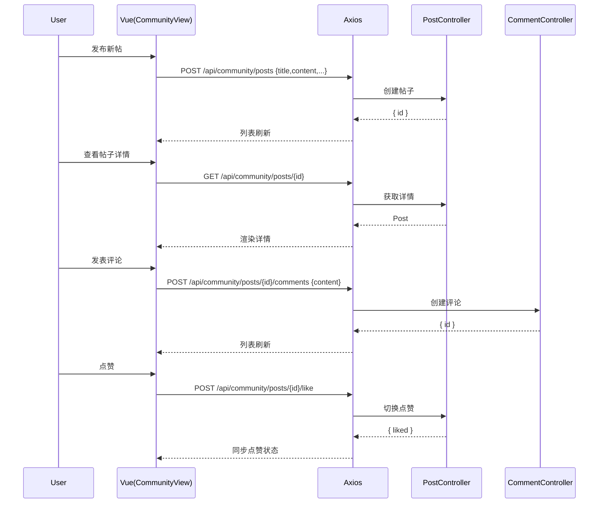

# 社区 API（Community）

> 以 Swagger 为准：`http://localhost:8080/api/swagger-ui.html`

## 1. 帖子与检索
- `GET /api/community/posts`：帖子列表（`page/size/category/keyword/tag/orderBy`）
请求：
```
GET /api/community/posts?page=1&size=10&orderBy=latest
Authorization: Bearer <token>
```
响应（示例）：
```json
{ "code":200, "data": { "items": [{"id":101,"title":"First Post","likeCount":3}], "total": 24, "page":1, "size":10 } }
```

- `GET /api/community/posts/{id}`：帖子详情
- `POST /api/community/posts`：创建
请求：
```json
{ "title":"How to learn AI?", "content":"...", "category":"qa", "tags":["ai","study"] }
```
响应：
```json
{ "code":200, "data": { "id": 101, "title": "How to learn AI?" } }
```
- `PUT /api/community/posts/{id}`：编辑（作者）
- `DELETE /api/community/posts/{id}`：删除（作者）
- `POST /api/community/posts/{id}/like`：点赞/取消 → `{ liked: true|false }`

## 2. 评论
- `GET /api/community/posts/{postId}/comments`：评论列表（`page/size/parentId/orderBy`）
- `POST /api/community/posts/{postId}/comments`：发表评论
请求：
```json
{ "content": "Nice post!", "parentId": null }
```
响应：
```json
{ "code":200, "data": { "id": 9001, "content": "Nice post!" } }
```
- `POST /api/community/comments/{commentId}/like`：评论点赞
- `DELETE /api/community/comments/{commentId}`：删除评论

## 3. 统计与我的帖子
- `GET /api/community/stats`：社区统计
- `GET /api/community/hot-topics?limit=10`：热门话题
- `GET /api/community/active-users?limit=10`：活跃用户
- `GET /api/community/my-posts`：我的帖子
- `GET /api/community/search/tags?keyword=...&limit=...`：搜索标签

## 4. 返回码对照
- 200：成功
- 400：非法参数（分页/过滤/内容为空）
- 401：未认证
- 403：无权编辑/删除非本人帖子或评论
- 404：帖子/评论不存在
- 5xx：服务端错误

---

# 前端对接（community.api.ts）

- `getPosts(params)` / `getPostById(id)` / `createPost(data)` / `updatePost(id, data)` / `deletePost(id)` / `likePost(id)`
- `getCommentsByPostId(postId, params)` / `createComment(postId, content, parentId?)` / `likeComment(commentId)` / `deleteComment(commentId)`
- `getCommunityStats()` / `getHotTopics(limit?)` / `getActiveUsers(limit?)` / `getMyPosts(params)` / `searchTags(keyword, limit?)`

## 常见错误
- 401：未登录
- 403：无权编辑/删除非本人帖子或评论
- 400：参数非法（分页/过滤）

---

## 时序图：帖子与评论生命周期

