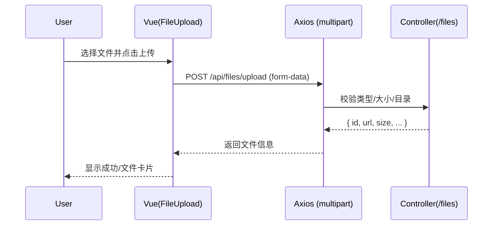
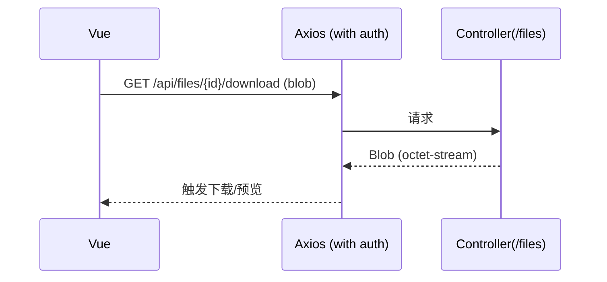

# 文件 API（File）

> 以 Swagger 为准：`http://localhost:8080/api/swagger-ui.html`

## 1. 端点总览（与后端对齐）
- `POST /api/files/upload`：上传文件（`multipart/form-data`，字段：`file`，可选 `purpose/relatedId`）
- `GET /api/files/{fileId}/info`：获取文件信息
- `GET /api/files/related?purpose=...&relatedId=...`：按用途与关联ID查询文件列表
- `GET /api/files/my?purpose=...`：我的文件列表
- `GET /api/files/storage/usage`：存储使用量统计
- `GET /api/files/{fileId}/download`：下载文件（二进制）
- `GET /api/files/{fileId}/preview`：预览图片（二进制，`image/*`）
- `GET /api/files/{fileId}/stream`：视频流播放（支持 Range，`video/*`）
- `DELETE /api/files/{fileId}`：删除文件
- `DELETE /api/files/batch`：批量删除文件（请求体：`[fileId, ...]`）

---

## 2. 上传与信息

- 请求（curl）：
```bash
curl -H "Authorization: Bearer $TOKEN" \
  -F file=@/path/to/file.pdf \
  -F purpose=assignment \
  -F relatedId=123 \
  http://localhost:8080/api/files/upload
```
- 成功响应：
```json
{
  "code": 200,
  "message": "success",
  "data": {
    "id": 9876,
    "originalName": "file.pdf",
    "mimeType": "application/pdf",
    "size": 102400,
    "uploaderId": 1001,
    "relatedType": "assignment",
    "relatedId": 123,
    "downloadCount": 0,
    "status": "active"
  }
}
```

- 获取信息：
```bash
curl -H "Authorization: Bearer $TOKEN" \
  http://localhost:8080/api/files/9876/info
```
- 成功响应：
```json
{
  "code": 200,
  "data": {
    "id": 9876,
    "originalName": "file.pdf",
    "mimeType": "application/pdf",
    "size": 102400,
    "uploaderId": 1001,
    "downloadCount": 0,
    "status": "active"
  }
}
```

---

## 3. 关联/我的/存储

- 关联文件列表：
```bash
curl -H "Authorization: Bearer $TOKEN" \
  "http://localhost:8080/api/files/related?purpose=assignment&relatedId=123"
```
- 我的文件列表（可选 purpose 过滤）：
```bash
curl -H "Authorization: Bearer $TOKEN" \
  "http://localhost:8080/api/files/my?purpose=assignment"
```
- 存储使用量：
```bash
curl -H "Authorization: Bearer $TOKEN" \
  http://localhost:8080/api/files/storage/usage
```
- 存储使用量响应：
```json
{
  "code": 200,
  "data": {
    "usage": 5242880,
    "usageFormatted": "5.0 MB",
    "limit": 104857600,
    "limitFormatted": "100MB"
  }
}
```

---

## 4. 下载与预览

- 下载（二进制流）：
```bash
curl -H "Authorization: Bearer $TOKEN" -L \
  http://localhost:8080/api/files/9876/download \
  -o file_9876.pdf
```
- 预览图片（二进制流，需浏览器/图片查看器）：
```bash
curl -H "Authorization: Bearer $TOKEN" \
  http://localhost:8080/api/files/999/preview --output preview.jpg
```
- 注意：下载/预览返回的是原始二进制，不包裹在 `ApiResponse` 中，响应头包含 `Content-Type` 与 `Content-Disposition`（下载）。

### 4.1 视频流（推荐用于 `<video>` 播放）

```bash
curl -H "Authorization: Bearer $TOKEN" -H "Range: bytes=0-1048575" \
  http://localhost:8080/api/files/9876/stream --output seg.bin
```

- 特性：
  - 支持 `Range` 请求，返回 `206 Partial Content`；设置 `Accept-Ranges: bytes`、`Content-Range`、`Content-Length`。
  - `Content-Type` 依据文件 MIME（如 `video/mp4`）。
  - 适合 `<video>` 和 HLS 外链。

---

## 5. 删除与批量删除

- 删除：
```bash
curl -X DELETE -H "Authorization: Bearer $TOKEN" \
  http://localhost:8080/api/files/9876
```
- 批量删除：
```bash
curl -X DELETE -H "Authorization: Bearer $TOKEN" -H "Content-Type: application/json" \
  -d '[9876, 9999, 10000]' \
  http://localhost:8080/api/files/batch
```
- 批量删除成功响应：
```json
{ "code": 200, "data": { "deleted": 2, "failed": [10000] } }
```

---

## 6. 返回码对照
- 200：成功
- 400：参数非法（缺少 `file`、`relatedId` 非法、预览非图片）或大小/类型不合规
- 401：未认证
- 403：无权访问/下载/删除他人文件
- 404：文件不存在或已被删除
- 5xx：服务端错误或磁盘/存储异常

---

# 前端对接（file.api.ts）
- `uploadFile(file, extra?)` ↔ `POST /api/files/upload`
- `getFileInfo(fileId)` ↔ `GET /api/files/{fileId}/info`
- `getRelatedFiles(purpose, relatedId)` ↔ `GET /api/files/related`
- `downloadFile(fileId, filename?)` ↔ `GET /api/files/{fileId}/download`
- `getPreview(fileId)` ↔ `GET /api/files/{fileId}/preview`
- `deleteFile(fileId)` / `batchDeleteFiles(ids)` ↔ `DELETE /api/files/{fileId}` / `DELETE /api/files/batch`
- `getMyFiles(purpose?)` ↔ `GET /api/files/my`
- `getStorageUsage()` ↔ `GET /api/files/storage/usage`

## 注意事项
- 上传白名单、大小与目录见 `application.yml` 的 `file.*` 配置
- 下载与预览需带鉴权头（前端用 axios 客户端发起）
- 预览仅允许 `image/*` 类型

---

## 时序图：文件上传


## 时序图：文件下载/预览

