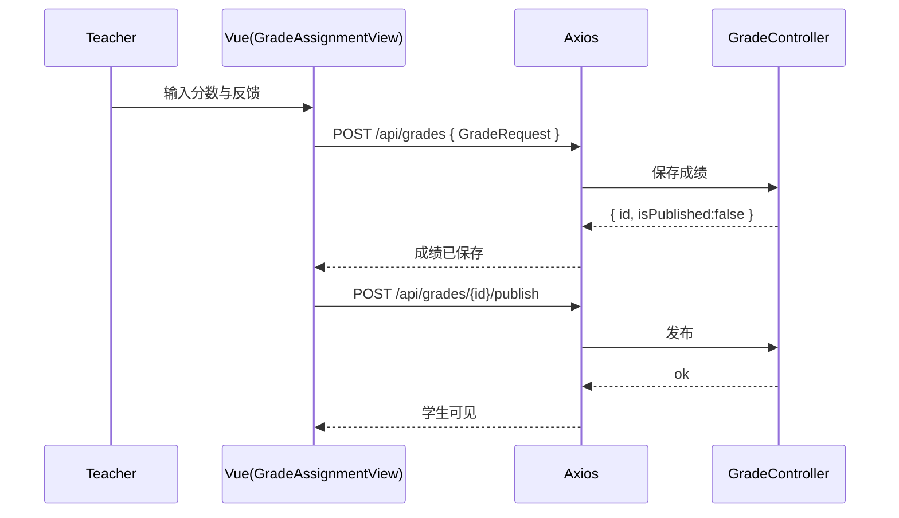

# 评分 API（Grade）

> 以 Swagger 为准：`http://localhost:8080/api/swagger-ui.html`

## 1. 打分与发布
- `POST /api/grades`：对提交打分（`GradeRequest`）
请求：
```json
{ "submissionId":"123","studentId":"1001","assignmentId":"88","score":95,"feedback":"Great","maxScore":100,"publishImmediately":false }
```
响应：
```json
{ "code":200, "data": { "id":"g-1","isPublished": false, "score":95 } }
```

- `POST /api/grades/{id}/publish`：发布成绩
- `POST /api/grades/batch`：批量打分
- `POST /api/grades/batch-publish`：批量发布

## 2. 查询
- `GET /api/grades/{id}`：成绩详情
- `GET /api/grades/{id}/history`：成绩历史
- `GET /api/grades/student/{studentId}/assignment/{assignmentId}`：某学生某作业成绩
- `GET /api/grades/student/{studentId}/page`：按学生分页
- `GET /api/grades/assignment/{assignmentId}/page`：按作业分页

## 3. 返回码对照
- 200：成功
- 400：分值/维度不合法
- 401：未认证
- 403：非授课教师无权限
- 404：成绩/提交不存在
- 409：重复发布或并发冲突
- 5xx：服务端错误

---

# 前端对接（grade.api.ts）

## 1. 方法映射
- `gradeSubmission(data)` ↔ `POST /api/grades`
- `getGradeById(id)` ↔ `GET /api/grades/{id}`
- `getGradeHistory(id)` ↔ `GET /api/grades/{id}/history`
- `getGradeForStudentAssignment(studentId, assignmentId)` ↔ 对应端点
- `getGradesByStudent(studentId, params)`、`getGradesByAssignment(assignmentId, params)` ↔ 分页查询
- `publishGrade(id)` / `gradeBatchSubmissions(grades)` / `publishBatchGrades(ids)`

## 2. 时序图：评分与发布


## 4. curl 示例
打分：
```bash
curl -X POST 'http://localhost:8080/api/grades' \
  -H 'Authorization: Bearer <access_jwt>' \
  -H 'Content-Type: application/json' \
  -d '{"submissionId":"123","studentId":"1001","assignmentId":"88","score":95,"feedback":"Great","maxScore":100,"publishImmediately":false}'
```

发布成绩：
```bash
curl -X POST 'http://localhost:8080/api/grades/g-1/publish' \
  -H 'Authorization: Bearer <access_jwt>'
```

按作业分页查询：
```bash
curl 'http://localhost:8080/api/grades/assignment/88/page?page=1&size=10' \
  -H 'Authorization: Bearer <access_jwt>'
```

## 5. 错误与排查
- 400 分值不合法：检查 score ∈ [0, maxScore]
- 401/403：确认角色为授课教师
- 404：成绩或提交不存在；核对 `id/submissionId`
- 409：重复发布/并发冲突；重试或查询状态后再操作
