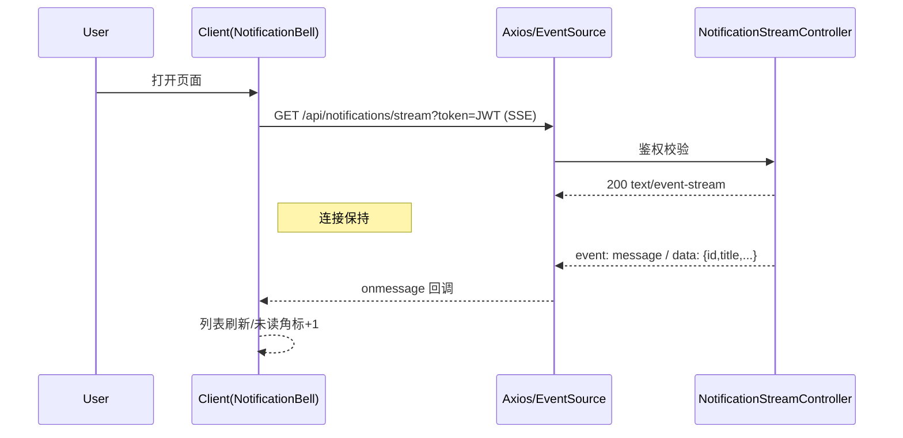
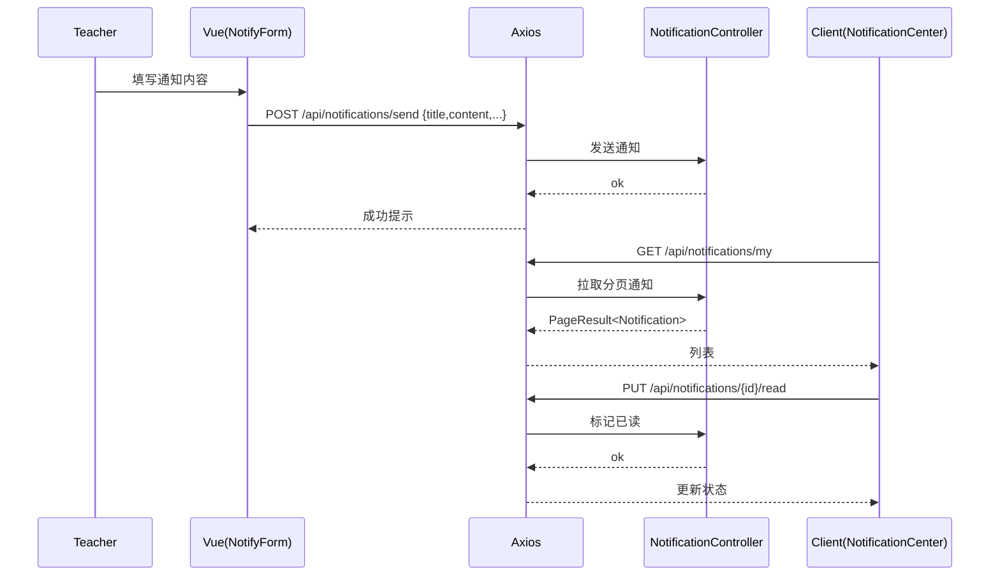

# 通知 API（Notification）

> 以 Swagger 为准：`http://localhost:8080/api/swagger-ui.html`

## 1. 我的通知与统计
- `GET /api/notifications/my`：分页获取我的通知（支持 `type?page=1&size=20`）
请求（示例）：
```
GET /api/notifications/my?page=1&size=10&type=system
Authorization: Bearer <token>
```
响应（示例）：
```json
{
  "code": 200,
  "data": {
    "items": [
      {
        "id": 10001,
        "title": "课程更新",
        "content": "第3课新增练习",
        "type": "system",
        "category": "course",
        "priority": "normal",
        "isRead": false,
        "createdAt": "2025-01-01T10:20:30Z"
      }
    ],
    "total": 37,
    "page": 1,
    "size": 10
  }
}
```

- `GET /api/notifications/{id}`：通知详情
```
GET /api/notifications/10001
Authorization: Bearer <token>
```
响应：
```json
{ "code":200, "data": { "id":10001, "title":"课程更新", "isRead": false, "content": "..." } }
```

- `GET /api/notifications/unread/count`：未读数量
```
GET /api/notifications/unread/count?type=system
Authorization: Bearer <token>
```
响应：
```json
{ "code":200, "data": { "unreadCount": 5 } }
```

- `GET /api/notifications/stats`：统计信息
```
GET /api/notifications/stats
Authorization: Bearer <token>
```
响应（示例）：
```json
{ "code":200, "data": { "total": 37, "unread": 5, "byType": { "system": 20, "message": 17 } } }
```

## 2. 已读与删除
- `PUT /api/notifications/{id}/read`：标记已读
```
PUT /api/notifications/10001/read
Authorization: Bearer <token>
```
响应：
```json
{ "code":200, "data": null }
```

- `PUT /api/notifications/batch/read`：批量已读
```
PUT /api/notifications/batch/read
Authorization: Bearer <token>
Content-Type: application/json

[10001,10002,10003]
```
响应：
```json
{ "code":200, "data": { "marked": 3 } }
```

- `PUT /api/notifications/all/read`：全部已读
```
PUT /api/notifications/all/read
Authorization: Bearer <token>
```
响应：
```json
{ "code":200, "data": { "markedCount": 37 } }
```

- `DELETE /api/notifications/{id}`：删除
- `DELETE /api/notifications/batch`：批量删除
```
DELETE /api/notifications/batch
Authorization: Bearer <token>
Content-Type: application/json

[10001,10002]
```
响应：
```json
{ "code":200, "data": { "deleted": 2 } }
```

## 3. 发送（教师）
- `POST /api/notifications/send`：发送单条
请求：
```json
{
  "recipientId": 20001,
  "title": "作业提醒",
  "content": "今晚24:00截止",
  "type": "assignment",
  "category": "deadline",
  "priority": "high",
  "relatedType": "assignment",
  "relatedId": 31001
}
```
响应：
```json
{ "code":200, "data": { "id": 120001, "title": "作业提醒" } }
```

- `POST /api/notifications/batch/send`：批量发送
请求：
```json
{
  "recipientIds": [20001,20002,20003],
  "title": "课程公告",
  "content": "明日调课",
  "type": "course",
  "category": "notice",
  "priority": "normal",
  "relatedType": "course",
  "relatedId": 21001
}
```
响应：
```json
{ "code":200, "data": { "sent": 3 } }
```

- `POST /api/notifications/assignment/{assignmentId}`：向作业相关学生发送通知
```
POST /api/notifications/assignment/31001?type=deadline&customMessage=今晚24:00截止
Authorization: Bearer <teacher_token>
```

- `POST /api/notifications/course/{courseId}`：向课程相关学生发送通知
```
POST /api/notifications/course/21001?type=notice&customMessage=明日调课
Authorization: Bearer <teacher_token>
```

## 4. 会话
- `GET /api/notifications/conversation?peerId=...`：与某人的会话
- `POST /api/notifications/conversation/read?peerId=...`：标记会话已读

请求：
```
GET /api/notifications/conversation?peerId=20002&page=1&size=20
Authorization: Bearer <token>
```
响应：
```json
{ "code":200, "data": { "items": [{"id":1,"content":"hi"}], "total": 1, "page":1, "size":20 } }
```

## 5. 实时通知（SSE）
- `GET /api/notifications/stream`：SSE 订阅（支持查询参数 `token` 或 `Authorization: Bearer` 头）

示例：
```
GET /api/notifications/stream?token=<jwt>
Accept: text/event-stream
```
事件示例：
```
event: message
data: {"id":120001,"title":"作业提醒","isRead":false}
```

安全：需要有效访问令牌；无效或缺失返回 401。

---

## 返回码对照
- 200：成功
- 400：参数非法（分页、空标题/内容、批量列表为空）
- 401：未认证（缺少/无效 token）
- 403：无权限（非教师发送、越权访问他人会话）
- 404：通知不存在
- 5xx：服务端错误

---

# 前端对接（notification.api.ts）
- `getMyNotifications(params)` ↔ `GET /api/notifications/my`
- `getNotification(id)` ↔ `GET /api/notifications/{id}`
- `getUnreadCount()` ↔ `GET /api/notifications/unread/count`
- `getNotificationStats()` ↔ `GET /api/notifications/stats`
- `markAsRead(id)` / `batchMarkAsRead(ids)` / `markAllAsRead()`
- `deleteNotification(id)` / `batchDeleteNotifications(ids)`
- `sendNotification(data)` / `batchSend(data)`
- `getConversation(peerId, params)` / `readConversation(peerId)`
- `subscribeSse(token?)`：`GET /api/notifications/stream`

---

## 时序图：SSE 订阅与消息到达


## 时序图：发送与阅读

