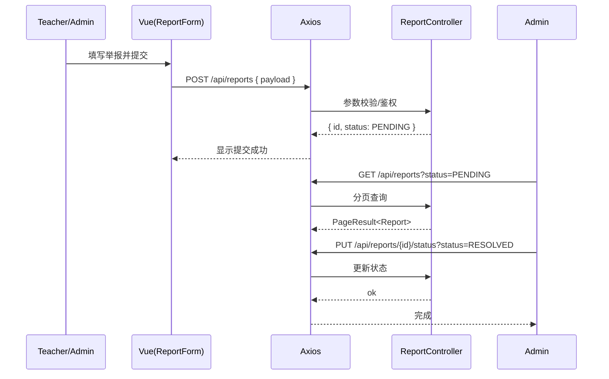

# 举报/报表 API（Report）

> 以 Swagger 为准：`http://localhost:8080/api/swagger-ui.html`

## 1. 端点总览（与后端对齐）
- `POST /api/reports`：提交举报（角色：`TEACHER`、`ADMIN`）
- `GET /api/reports/{id}`：举报详情（角色：`TEACHER`、`ADMIN`）
- `GET /api/reports?status=&page=&size=`：分页列表（角色：`ADMIN`）
- `PUT /api/reports/{id}/status?status=`：更新举报状态（角色：`ADMIN`）

---

## 2. 提交举报
- 请求（curl）：
```bash
curl -H "Authorization: Bearer $TOKEN" -H "Content-Type: application/json" \
  -d '{
    "reportedStudentId": 1001,
    "courseId": 2001,
    "assignmentId": 3001,
    "submissionId": 4001,
    "reason": "Academic integrity concern",
    "details": "Suspected plagiarism",
    "evidenceFileId": 5678
  }' \
  http://localhost:8080/api/reports
```
- 成功响应：
```json
{
  "code": 200,
  "data": {
    "id": 90001,
    "reporterId": 888,
    "reportedStudentId": 1001,
    "status": "PENDING",
    "reason": "Academic integrity concern"
  }
}
```

---

## 3. 查看详情
```bash
curl -H "Authorization: Bearer $TOKEN" \
  http://localhost:8080/api/reports/90001
```
- 成功响应：
```json
{
  "code": 200,
  "data": {
    "id": 90001,
    "reporterId": 888,
    "reportedStudentId": 1001,
    "courseId": 2001,
    "assignmentId": 3001,
    "submissionId": 4001,
    "status": "PENDING",
    "reason": "Academic integrity concern",
    "details": "Suspected plagiarism",
    "evidenceFileId": 5678,
    "createdAt": "2025-01-01T12:00:00Z"
  }
}
```

---

## 4. 分页列表（管理员）
```bash
curl -H "Authorization: Bearer $TOKEN" \
  "http://localhost:8080/api/reports?status=PENDING&page=1&size=10"
```
- 成功响应：
```json
{
  "code": 200,
  "data": {
    "items": [
      { "id": 90001, "status": "PENDING", "reason": "Academic integrity concern" }
    ],
    "total": 1,
    "page": 1,
    "size": 10
  }
}
```

---

## 5. 更新状态（管理员）
```bash
curl -X PUT -H "Authorization: Bearer $TOKEN" \
  "http://localhost:8080/api/reports/90001/status?status=RESOLVED"
```
- 成功响应：
```json
{ "code": 200, "message": "success" }
```

---

## 6. 返回码对照
- 200：成功
- 400：参数非法（缺少必填、`status` 值非法）
- 401：未认证
- 403：无权限（非教师/管理员创建、非管理员列表与更新状态）
- 404：举报单不存在
- 5xx：服务端错误

---

# 前端对接（report.api.ts）
- `createReport(data)` ↔ `POST /api/reports`
- `getReport(id)` ↔ `GET /api/reports/{id}`
- `listReports(params)` ↔ `GET /api/reports`
- `updateReportStatus(id, status)` ↔ `PUT /api/reports/{id}/status`

---

## 时序图：举报创建-审核流程

