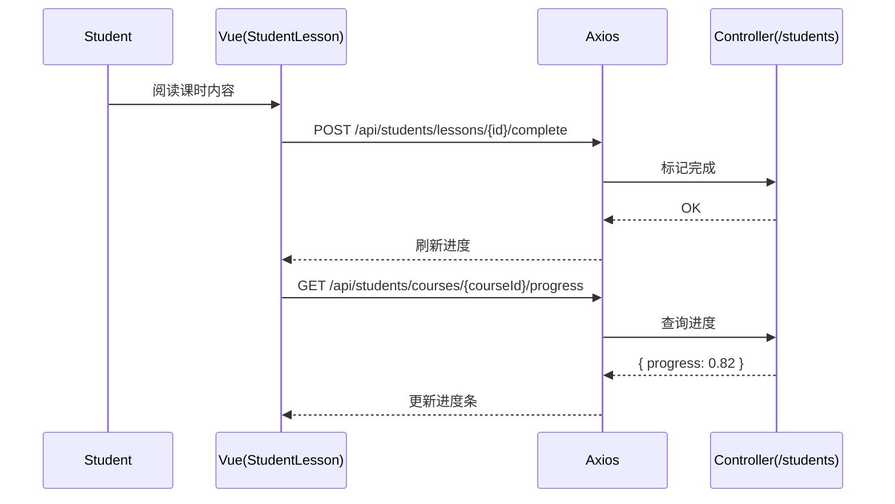

# 学生端 API（Student）

> 以 Swagger 为准：`http://localhost:8080/api/swagger-ui.html`

## 进度口径（更新）
- 课节完成条件（OR）：
  1) 视频观看≥98% 且资料已阅读；
  2) 若该节次绑定了作业（assignment_type=course_bound），且学生对该作业已“提交”或“已评分”，视为该节完成。
- 课程进度：按课节权重（`lessons.weight`）聚合的完成/进度；绑定作业的完成会直接将该节计为完成。
- 学生 Dashboard 整体进度：所有已选课程进度的平均（沿用后端聚合）。
- 教师端“学生管理”进度：与课程内口径一致（即含绑定作业影响）。

## 1. 仪表盘与学习进度
- `GET /api/students/dashboard`：学生仪表盘数据
请求：
```
GET /api/students/dashboard
Authorization: Bearer <token>
```
响应（示例）：
```json
{ "code":200, "data": { "recentActivities":[], "kpis": {"courses":5, "assignments":12} } }
```

- `GET /api/students/my-courses/paged`：我的课程（分页，`page/size/q`）
请求：
```
GET /api/students/my-courses/paged?page=1&size=10&q=AI
Authorization: Bearer <token>
```
响应：
```json
{ "code":200, "data": { "items":[{"id":"2","title":"AI"}], "total": 12, "page":1, "size":10 } }
```

- `GET /api/students/courses/{courseId}/progress`：课程进度（返回 `progress/totalStudyMinutes/weeklyStudyMinutes/lastStudiedLessonTitle`）

## 2. 课时
- `GET /api/students/lessons/{lessonId}`：课时详情
- `POST /api/students/lessons/{lessonId}/complete`：标记完成
- `POST /api/students/lessons/{lessonId}/incomplete`：标记未完成

## 3. 作业与提交
- `GET /api/students/my-submissions`：我提交的作业（可按 `courseId` 过滤）
- `GET /api/students/assignments`：学生端作业列表（`courseId/status/q`）

## 4. 学生分析（聚合）
- `GET /api/students/analysis?range=7d|30d|term`：成绩/完成率/学习时长等聚合数据
请求：
```
GET /api/students/analysis?range=30d
Authorization: Bearer <token>
```
响应（示例）：
```json
{ "code":200, "data": { "kpi": {"avgScore":88.2,"completionRate":0.93}, "radar": {"invest":0.7,"quality":0.8,"mastery":0.75,"stability":0.72,"growth":0.83}, "trends": {"score":[],"completion":[],"hours":[]}, "recentGrades":[] } }
```

## 5. 参与者
- `GET /api/students/courses/{courseId}/participants?keyword=...`：课程参与者（教师与同学）

## 6. 返回码对照
- 200：成功
- 400：非法参数（分页/范围）
- 401：未认证
- 403：非课程成员访问受限资源
- 404：课程/课时不存在
- 5xx：服务端错误

---

# 前端对接（student.api.ts）
- `getDashboardData()` ↔ `GET /api/students/dashboard`
- `getMyCourses(params)` ↔ `GET /api/students/my-courses/paged`
- `getCourseProgress(courseId)` ↔ `GET /api/students/courses/{courseId}/progress`
- `getLessonDetails(lessonId)` / `markLessonAsCompleted(lessonId)` / `markLessonAsIncomplete(lessonId)` ↔ `/api/students/lessons/*`
- `getMySubmissions(params)` ↔ `GET /api/students/my-submissions`
- `getAnalysis(params)` ↔ `GET /api/students/analysis`
- `getCourseParticipants(courseId, keyword?)` ↔ `GET /api/students/courses/{courseId}/participants`
- `getAssignments(params)` ↔ `GET /api/students/assignments`

## 时序图：课时完成与进度

