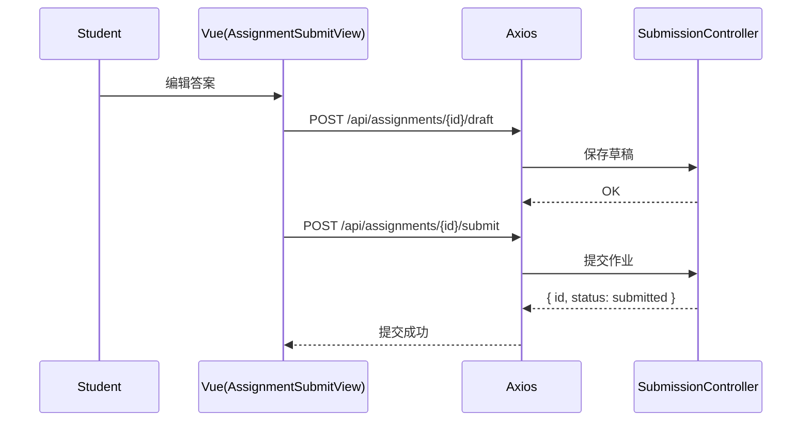

# 提交 API（Submission）

> 以 Swagger 为准：`http://localhost:8080/api/swagger-ui.html`

## 1. 查询与导出
- `GET /api/submissions/{id}`：按提交 ID 查询
请求：
```
GET /api/submissions/123
Authorization: Bearer <token>
```
响应：
```json
{ "code": 200, "data": { "id": "123", "assignmentId": "88", "studentId": "1001", "status": "graded" } }
```

- `GET /api/assignments/{assignmentId}/submission`：查询我对该作业的提交
- `GET /api/assignments/{assignmentId}/submissions`：该作业所有提交（分页，教师）
- `GET /api/submissions/{id}/export`：导出 ZIP（二进制）

## 2. 创建与草稿
- `POST /api/assignments/{assignmentId}/submit`：提交作业
请求：
```json
{ "content": "My answer...", "fileIds": ["5678","5679"] }
```
响应：
```json
{ "code": 200, "data": { "id": "123", "status": "submitted", "submittedAt": "2025-01-01 12:00:00" } }
```

- `POST /api/assignments/{assignmentId}/draft`：保存草稿
请求：
```json
{ "content": "Draft...", "fileIds": ["5678"] }
```
响应：
```json
{ "code": 200, "message": "OK" }
```

## 3. 返回码对照
- 200：成功
- 400：参数非法/内容为空/文件不合法
- 401：未认证
- 403：非课程成员或无查看权限
- 404：作业/提交不存在
- 409：重复提交/状态冲突
- 5xx：服务端错误

---

# 前端对接（submission.api.ts）

## 1. 方法映射
- `getSubmissionById(id)` ↔ `GET /api/submissions/{id}`
- `getSubmissionForAssignment(assignmentId)` ↔ `GET /api/assignments/{assignmentId}/submission`
- `getSubmissionsByAssignment(assignmentId, params)` ↔ `GET /api/assignments/{assignmentId}/submissions`
- `submitAssignment(assignmentId, data)` ↔ `POST /api/assignments/{assignmentId}/submit`
- `saveDraft(assignmentId, data)` ↔ `POST /api/assignments/{assignmentId}/draft`
- `exportSubmission(id)` ↔ `GET /api/submissions/{id}/export`（blob）

## 2. 常见错误
- 400：提交内容缺失或不合法
- 401：未登录；403：不是该课程学生/非授课教师

## 3. 时序图：提交与草稿


## 4. curl 示例
保存草稿：
```bash
curl -X POST 'http://localhost:8080/api/assignments/88/draft' \
  -H 'Authorization: Bearer <access_jwt>' \
  -H 'Content-Type: application/json' \
  -d '{"content":"Draft...","fileIds":["5678"]}'
```

提交作业：
```bash
curl -X POST 'http://localhost:8080/api/assignments/88/submit' \
  -H 'Authorization: Bearer <access_jwt>' \
  -H 'Content-Type: application/json' \
  -d '{"content":"My answer...","fileIds":["5678","5679"]}'
```

导出提交：
```bash
curl -L -OJ 'http://localhost:8080/api/submissions/123/export' \
  -H 'Authorization: Bearer <access_jwt>'
```

## 5. 错误与排查
- 400：内容为空/附件不合法；检查 `content` 与 `fileIds`
- 401/403：确认为课程成员且已登录
- 404：提交或作业不存在；确认 `id/assignmentId`
- 409：重复提交；检查当前提交状态
