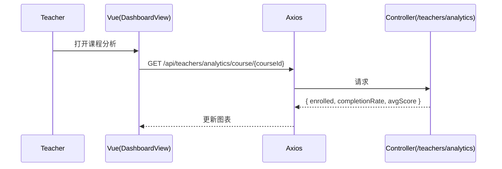
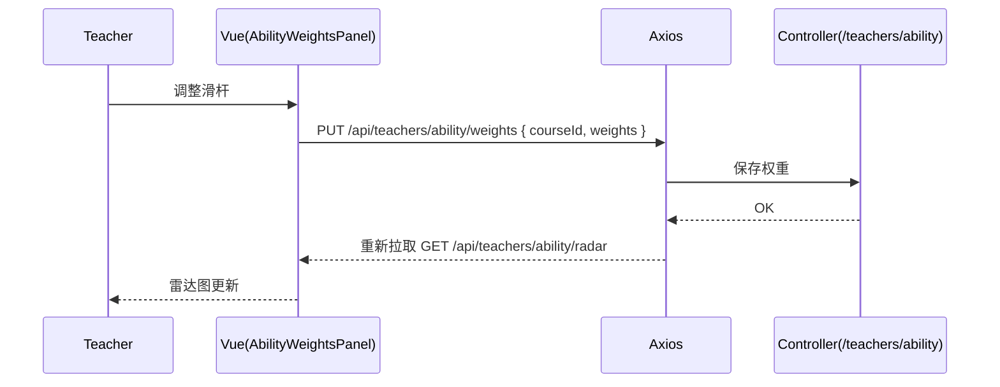

# 教师端 API（Teacher）

> 以 Swagger 为准：`http://localhost:8080/api/swagger-ui.html`

## 1. 分析指标
- `GET /api/teachers/analytics/course/{courseId}`：课程分析
请求：
```
GET /api/teachers/analytics/course/2
Authorization: Bearer <token>
```
响应（示例）：
```json
{ "code":200, "data": { "enrolled": 50, "completionRate": 0.87, "avgScore": 86.4 } }
```

- `GET /api/teachers/analytics/assignment/{assignmentId}`：作业分析
- `GET /api/teachers/analytics/class-performance/{courseId}`：班级表现
- `GET /api/teachers/analytics/course/{courseId}/students`：课程学生表现（分页过滤）
- `GET /api/teachers/analytics/course/{courseId}/students/export`：导出（blob）

## 2. 能力雷达与权重
- `GET /api/teachers/ability/radar`：雷达数据（`courseId/classId/studentId/startDate/endDate`）
- `GET /api/teachers/ability/weights?courseId=...`：获取权重
请求：
```
GET /api/teachers/ability/weights?courseId=2
Authorization: Bearer <token>
```
响应（示例）：
```json
{ "code":200, "data": { "invest":0.2, "quality":0.2, "mastery":0.2, "stability":0.2, "growth":0.2 } }
```

- `PUT /api/teachers/ability/weights`：更新权重
请求：
```json
{ "courseId": 2, "weights": { "invest":0.1, "quality":0.25, "mastery":0.25, "stability":0.2, "growth":0.2 } }
```
响应：
```json
{ "code":200, "message":"OK" }
```

- `GET /api/teachers/ability/radar/export`：导出雷达（blob）
- `POST /api/teachers/ability/radar/compare`：双区间对比（A/B）
- `POST /api/teachers/ability/radar/compare/export`：对比导出（blob）
- `POST /api/teachers/ability/dimension-insights`：维度洞察

## 3. 课程进度（维护）
- `POST /api/teachers/courses/{courseId}/students/{studentId}/progress/reset`：重置进度

## 4. 返回码对照
- 200：成功
- 400：非法参数（日期区间/权重和不等于 1 等）
- 401：未认证
- 403：非授课教师无权限
- 404：课程/学生不存在
- 409：并发/状态冲突
- 5xx：服务端错误

---

# 前端对接（teacher.api.ts）

- `getCourseAnalytics(courseId)` / `getAssignmentAnalytics(assignmentId)` / `getClassPerformance(courseId)`
- `getCourseStudentPerformance(courseId, params)` / `exportCourseStudents(courseId, params)`
- `getAllCourseStudentsBasic(courseId, keyword?)`
- `getAbilityRadar(params)` / `getAbilityWeights(courseId)` / `updateAbilityWeights(payload)`
- `exportAbilityRadarCsv(params)` / `postAbilityRadarCompare(body)` / `exportAbilityRadarCompareCsv(body)` / `postAbilityDimensionInsights(body)`
- `resetStudentCourseProgress(courseId, studentId)`

## 5. 时序图：课程分析拉取


## 6. 时序图：能力权重更新


## 7. 我的课程（教师）
- `GET /api/teachers/my-courses`

请求示例：
```
GET /api/teachers/my-courses
Authorization: Bearer <token>
```

响应示例：
```json
{
  "code": 200,
  "data": [
    { "id": 101, "title": "高等数学", "teacherId": 9, "status": "published" },
    { "id": 102, "title": "线性代数", "teacherId": 9, "status": "published" }
  ]
}
```

说明：返回当前登录教师所授课程列表，用于联系人聚合/聊天联系人分组等。

## 8. 教师联系人聚合（按课程）
- `GET /api/teachers/contacts`

Query 参数：
- `keyword`（可选）：按 `username` 或相关字段过滤学生。

请求示例：
```
GET /api/teachers/contacts?keyword=tom
Authorization: Bearer <token>
```

响应示例：
```json
{
  "code": 200,
  "data": {
    "groups": [
      {
        "courseId": 101,
        "courseTitle": "高等数学",
        "students": [
          { "id": 2001, "username": "tom", "avatar": "/u/2001.png" },
          { "id": 2002, "username": "jerry", "avatar": "/u/2002.png" }
        ]
      },
      {
        "courseId": 102,
        "courseTitle": "线性代数",
        "students": [
          { "id": 2003, "username": "alice", "avatar": null }
        ]
      }
    ]
  }
}
```

说明：服务端按课程返回学生通讯录，每个学生包含 `username` 与 `avatar`，前端可直接渲染为联系人分组列表。
