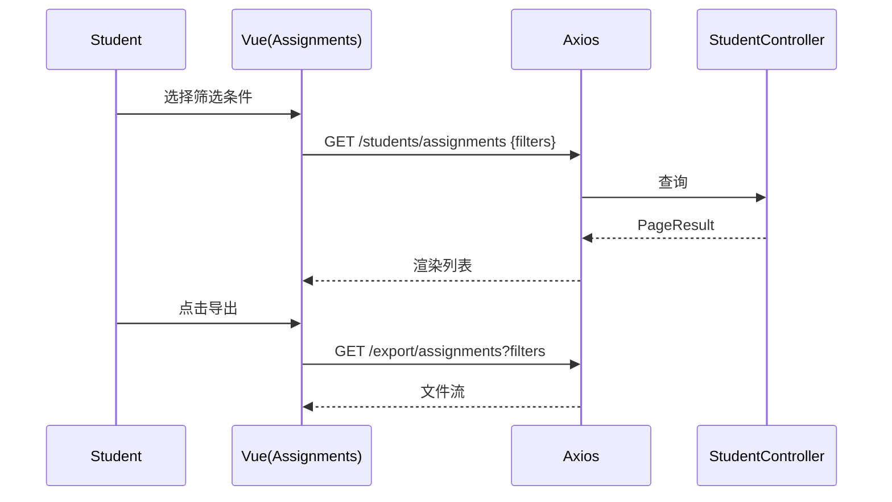
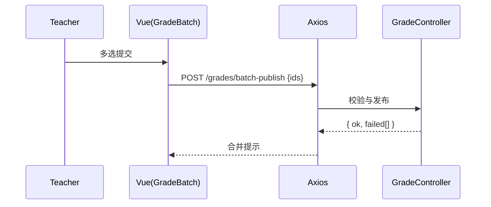
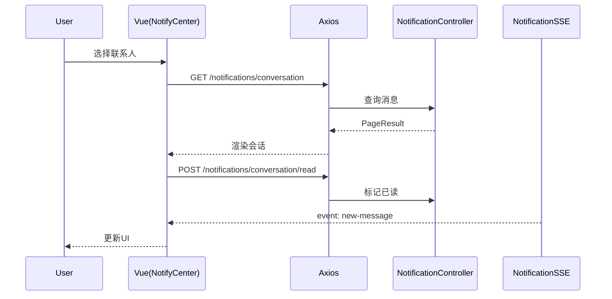
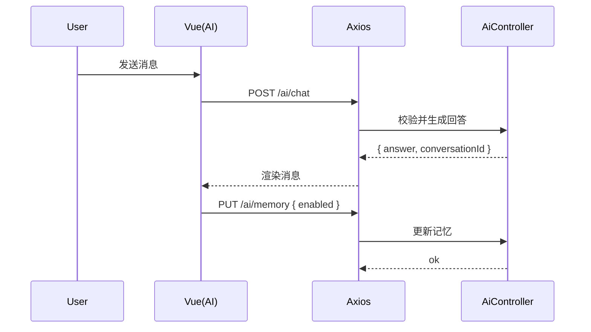

# 实战食谱（Cookbook）

选择任意 2–3 个任务完成，建议按顺序累积难度。每个任务包含：后端端点、前端改动、请求示例、验收清单、时序图。

---

## 任务A：学生端“我的作业”筛选与导出

### 后端（确认/对齐）
- `GET /api/students/assignments` 支持 `courseId/status/q/page/size`
- 导出：可选走提交导出或报表接口（视项目实现选择其一）

### 前端改动
- 视图：学生作业列表新增筛选（课程/状态/关键词）与导出按钮
- Store：封装查询与导出 action（导出可走文件接口或后端导出流）

### 请求示例
```bash
curl -H "Authorization: Bearer $TOKEN" \
  "http://localhost:8080/api/students/assignments?courseId=2001&status=ONGOING&page=1&size=10"
```

### 验收清单
- 切换筛选项，请求参数正确，分页一致
- 无数据时展示空态
- 导出得到 zip/csv，文件名、编码正确

### 时序图


---

## 任务B：教师端成绩发布批处理

### 后端（确认/对齐）
- `POST /api/grades/batch`
- `POST /api/grades/batch-publish`

### 前端改动
- 视图：批改页面支持多选并批量发布
- Store：新增批处理 action，合并成功/失败提示

### 请求示例
```bash
curl -X POST -H "Authorization: Bearer $TOKEN" -H "Content-Type: application/json" \
  -d '{"submissionIds": [4001,4002], "operation": "publish"}' \
  http://localhost:8080/api/grades/batch-publish
```

### 验收清单
- 多选状态同步；发布成功后通知触发
- 学生端可见成绩；重复发布有幂等提示

### 时序图


---

## 任务C：通知中心会话模式

### 后端（确认/对齐）
- `GET /api/notifications/conversation?peerId=...`
- `POST /api/notifications/conversation/read?peerId=...`
- SSE：`GET /api/notifications/stream?token=...`

### 前端改动
- 视图：通知中心按联系人分组与一键已读
- Store：封装按 `peerId` 拉取与已读的 action；SSE 订阅实时更新

### 请求示例
```bash
curl -H "Authorization: Bearer $TOKEN" \
  "http://localhost:8080/api/notifications/conversation?peerId=1001&page=1&size=20"
```

### 验收清单
- 切换联系人分页正确；读取状态与未读数量同步
- SSE 到达事件时 UI 即时刷新

### 时序图


---

## 任务D：AI 助手“会话管理”与记忆开关

### 后端（确认/对齐）
- 会话：`/api/ai/conversations` CRUD
- 记忆：`GET/PUT /api/ai/memory`
- 聊天：`POST /api/ai/chat`（自动创建会话/追加消息）

### 前端改动
- 视图：对话侧栏列出会话（置顶/归档/删除）；设置页控制记忆开关
- Store：封装会话与记忆 action；聊天记录滚动加载

### 请求示例
```bash
curl -H "Authorization: Bearer $TOKEN" -H "Content-Type: application/json" \
  -d '{"messages":[{"role":"user","content":"请点评作业3001"}],"model":"deepseek-chat"}' \
  http://localhost:8080/api/ai/chat
```

### 验收清单
- 新建/更新/删除会话可用；记忆开关与内容保存
- 聊天记录与已读状态正确；跨页滚动加载正常

### 时序图


---

## 任务E：能力雷达权重调优

### 后端（确认/对齐）
- 读取/更新：`GET/PUT /api/teachers/ability/weights`（以教师端为例）
- 趋势/对比导出：相关统计接口或按课程聚合

### 前端改动
- 视图：滑杆/输入框调整维度权重，右侧预览雷达变化（ECharts）
- Store：保存权重、拉取预览数据、支持导出 CSV

### 请求示例
```bash
curl -X PUT -H "Authorization: Bearer $TOKEN" -H "Content-Type: application/json" \
  -d '{"weights": {"communication":0.2,"teamwork":0.3,"creativity":0.5}}' \
  http://localhost:8080/api/teachers/ability/weights
```

### 验收清单
- 权重更新生效并持久化；预览图动态刷新
- 导出 CSV 字段完整、编码正确

---

## 调试清单
- Swagger 可调；前端空态/加载/异常友好
- 401/403/404/409 分类处理，日志记录上下文
- 文案支持中英文，新增类型与接口同步到文档
