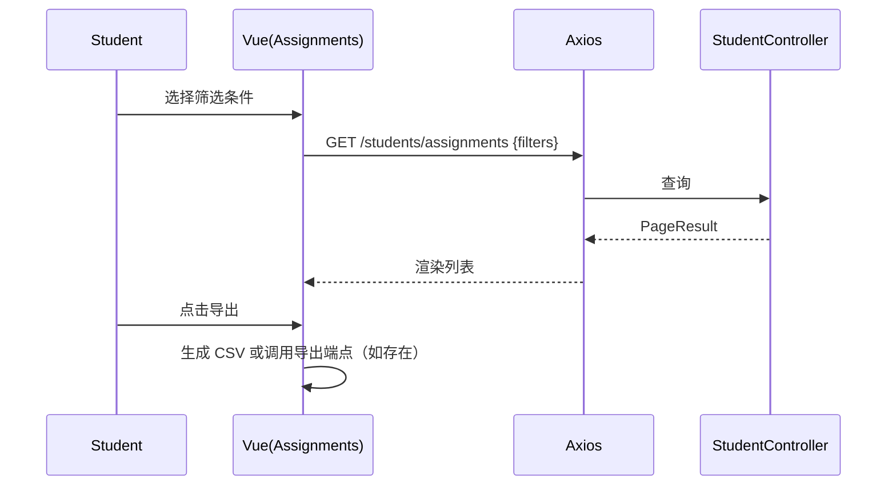
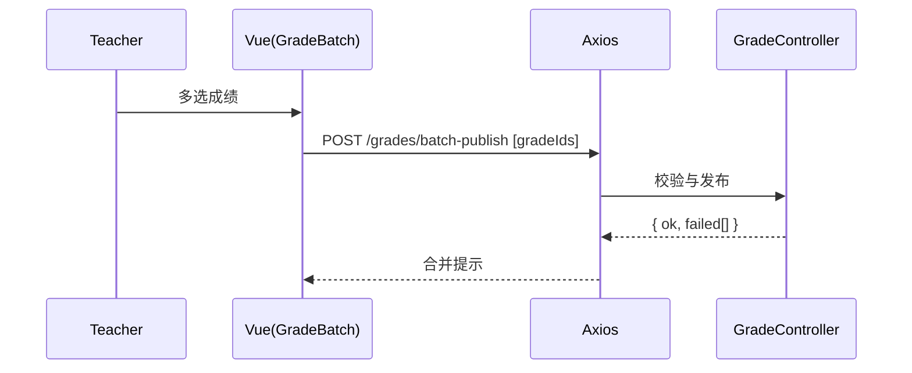
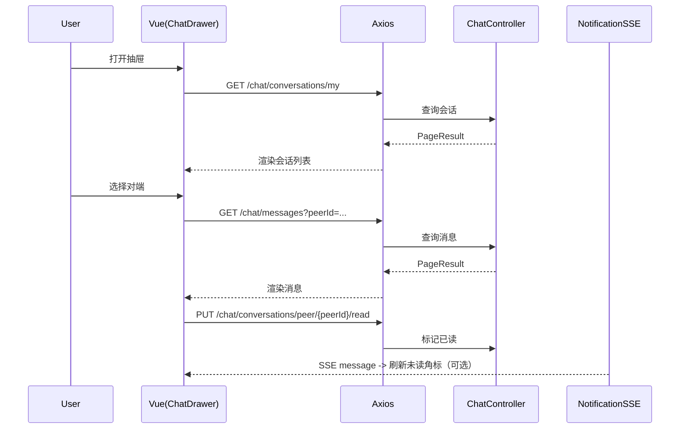
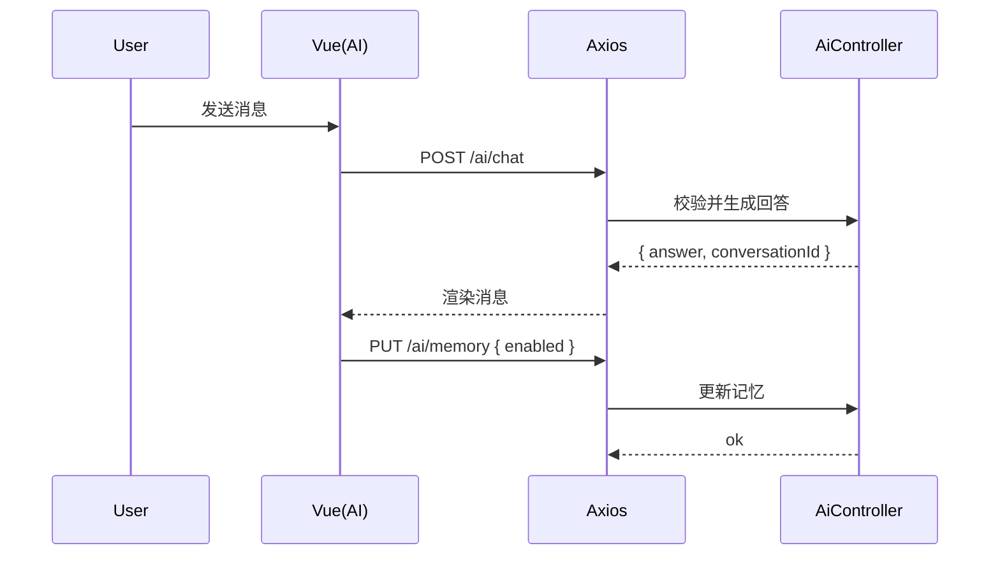

# 实战食谱（Cookbook）

选择任意 2-3 个任务完成，建议按顺序累积难度。每个任务尽量包含：后端端点、前端改动、请求示例、验收清单、时序图。

:::tip 约定
示例中的 URL 默认包含后端 `context-path=/api`，即 `http://localhost:8080/api/...`。
:::

---

## 任务A：学生端“我的作业”筛选与导出

### 后端（确认/对齐）
- `GET /api/students/assignments`：支持 `courseId/status/q/page/size` 等过滤（以 `StudentController.getMyAssignments` 为准）
- 导出：若后端无“导出端点”，可先做“当前筛选结果的 CSV（前端生成）”作为最小闭环

### 前端改动
- 视图：学生作业列表新增筛选（课程/状态/关键词）与导出按钮
- Store：封装查询与导出 action（导出可走文件接口或后端导出流）

### 请求示例
```bash
curl -H "Authorization: Bearer $TOKEN" \
  "http://localhost:8080/api/students/assignments?courseId=2001&status=pending&page=1&size=10&q=AI"
```

### 验收清单
- 切换筛选项，请求参数正确，分页一致
- 无数据时展示空态
- 导出得到 zip/csv，文件名、编码正确

### 时序图

```mermaid
sequenceDiagram
  participant S as Student
  participant V as Vue(Assignments)
  participant A as Axios
  participant C as StudentController

  S->>V: 选择筛选条件
  V->>A: GET /students/assignments {filters}
  A->>C: 查询
  C-->>A: PageResult
  A-->>V: 渲染列表
  S->>V: 点击导出
  V->>V: 生成 CSV 或调用导出端点（如存在）
```

---

## 任务B：教师端成绩发布批处理

### 后端（确认/对齐）
- `POST /api/grades/batch-publish`：Body 为 `gradeIds: number[]`

### 前端改动
- 视图：批改页面支持多选并批量发布
- Store：新增批处理 action，合并成功/失败提示

### 请求示例
```bash
curl -X POST \
  -H "Authorization: Bearer $TOKEN" \
  -H "Content-Type: application/json" \
  -d '[10001,10002,10003]' \
  http://localhost:8080/api/grades/batch-publish
```

### 验收清单
- 多选状态同步；发布成功后通知触发
- 学生端可见成绩；重复发布有幂等提示

### 时序图

```mermaid
sequenceDiagram
  participant T as Teacher
  participant V as Vue(GradeBatch)
  participant A as Axios
  participant G as GradeController

  T->>V: 多选成绩
  V->>A: POST /grades/batch-publish [gradeIds]
  A->>G: 校验与发布
  G-->>A: { ok, failed[] }
  A-->>V: 合并提示
```

---

## 任务C：聊天抽屉（最近会话 + 消息分页 + 已读）

### 后端（确认/对齐）
- 会话列表：`GET /api/chat/conversations/my`
- 消息分页：`GET /api/chat/messages?peerId=...&page=1&size=20`
- 标记已读：`PUT /api/chat/conversations/peer/{peerId}/read`
- SSE（通知）：`GET /api/notifications/stream?token=...`

### 前端改动
- 视图：聊天抽屉支持最近会话列表、按对端拉取消息、发送消息、已读同步
- Store：封装会话/消息的分页与已读 action；SSE 到达时刷新未读计数

### 请求示例
```bash
curl -H "Authorization: Bearer $TOKEN" \
  "http://localhost:8080/api/chat/messages?peerId=1001&page=1&size=20"
```

### 验收清单
- 切换联系人分页正确；读取状态与未读数量同步
- SSE 到达事件时 UI 即时刷新

### 时序图

```mermaid
sequenceDiagram
  participant U as User
  participant V as Vue(ChatDrawer)
  participant A as Axios
  participant C as ChatController
  participant S as NotificationSSE

  U->>V: 打开抽屉
  V->>A: GET /chat/conversations/my
  A->>C: 查询会话
  C-->>A: PageResult
  A-->>V: 渲染会话列表
  U->>V: 选择对端
  V->>A: GET /chat/messages?peerId=...
  A->>C: 查询消息
  C-->>A: PageResult
  A-->>V: 渲染消息
  V->>A: PUT /chat/conversations/peer/{peerId}/read
  A->>C: 标记已读
  S-->>V: SSE message -> 刷新未读角标（可选）
```

---

## 任务D：AI 助手“会话管理”与记忆开关

### 后端（确认/对齐）
- 会话：`/api/ai/conversations` CRUD
- 记忆：`GET/PUT /api/ai/memory`
- 聊天：`POST /api/ai/chat`（自动创建会话/追加消息）

### 前端改动
- 视图：对话侧栏列出会话（置顶/归档/删除）；设置页控制记忆开关
- Store：封装会话与记忆 action；聊天记录滚动加载

### 请求示例
```bash
curl -H "Authorization: Bearer $TOKEN" -H "Content-Type: application/json" \
  -d '{"messages":[{"role":"user","content":"请点评作业3001"}],"model":"google/gemini-2.5-pro"}' \
  http://localhost:8080/api/ai/chat
```

### 验收清单
- 新建/更新/删除会话可用；记忆开关与内容保存
- 聊天记录与已读状态正确；跨页滚动加载正常

### 时序图

```mermaid
sequenceDiagram
  participant U as User
  participant V as Vue(AI)
  participant A as Axios
  participant C as AiController

  U->>V: 发送消息
  V->>A: POST /ai/chat
  A->>C: 校验并生成回答
  C-->>A: { answer, conversationId }
  A-->>V: 渲染消息
  V->>A: PUT /ai/memory { enabled }
  A->>C: 更新记忆
  C-->>A: ok
```

---

## 任务E：能力雷达权重调优

### 后端（确认/对齐）
- 雷达：`GET /api/ability/student/radar?courseId=...`
- 对比：`POST /api/ability/student/radar/compare`
- 维度洞察：`POST /api/ability/student/dimension-insights`

### 前端改动
- 视图：课程选择 + 雷达图 + “对比分析/洞察”卡片（ECharts）
- Store：封装雷达/对比/洞察的请求与 loading/error 处理；支持导出 CSV/PNG（可选）

### 请求示例
```bash
curl -H "Authorization: Bearer $TOKEN" \
  "http://localhost:8080/api/ability/student/radar?courseId=2001"
```

### 验收清单
- 权重更新生效并持久化；预览图动态刷新
- 导出 CSV 字段完整、编码正确

---

## 调试清单
- Swagger 可调；前端空态/加载/异常友好
- 401/403/404/409 分类处理，日志记录上下文
- 文案支持中英文，新增类型与接口同步到文档
