# 端到端样例（API → 前端组件 E2E）

面向新手，逐步演示“一个后端接口，如何被前端消费并展示”。每个示例都覆盖：接口 → 类型 → 前端 API 封装 → Store → 视图/组件 → 交互与验证。

---

## 示例 1：登录与会话维护（POST /api/auth/login）

- 后端接口（Swagger 可测）：`POST /api/auth/login`
  - 请求体（示例）：`{ username, password }`
  - 响应体（示例）：`{ code: 200, data: { token, refreshToken, user } }`
- 前端对应文件：
  - 请求封装：`src/api/auth.api.ts` → `authApi.login(data)`
  - Axios 拦截器：`src/api/config.ts`
    - 登录/注册请求不附带旧 token
    - 其它请求附带 `Authorization: Bearer <token>`
    - 401 时清 token 并跳转登录页
  - Store：`src/stores/auth.ts`（命名可能为 `useAuthStore`）
    - `login` action 调用 `authApi.login`
    - 成功后保存 token 与 user
  - 视图：`src/features/auth/views/LoginView.vue`
    - 表单校验 → 触发 Store `login`
    - 成功后路由跳转至首页/仪表盘
- 验证要点：
  - 登录成功后，刷新页面仍保持登录态（token 持久化）
  - 未登录访问受限路由，路由守卫应跳转到登录页（见 `router/index.ts`）

时序图：
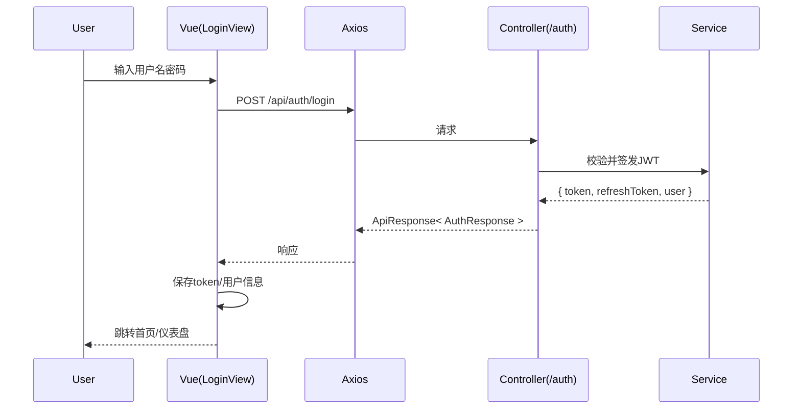

---

## 示例 2：课程列表分页（GET /api/courses?page=&size=&q=）

- 后端接口：`GET /api/courses`
  - 查询参数：`page`、`size`、`q`
  - 响应体：`{ code: 200, data: PageResult<CourseDto> }`
- 前端对应文件：
  - 请求封装：`src/api/course.api.ts`（示例方法：`listCourses(params)`）
  - Store：`src/stores/course.ts`（示例 `useCourseStore`）
    - `fetchCourses` action：调用 `listCourses`，保存 `items`、`total`、`page`、`size`
  - 视图：教师端 `src/features/teacher/views/ManageCourseView.vue`
    - 搜索框与分页器联动 → 触发 `fetchCourses`
    - 渲染课程卡片列表
- 验证要点：
  - 分页器切换页码/大小，请求参数变化正确
  - 空态、加载态、异常态提示清晰

时序图：
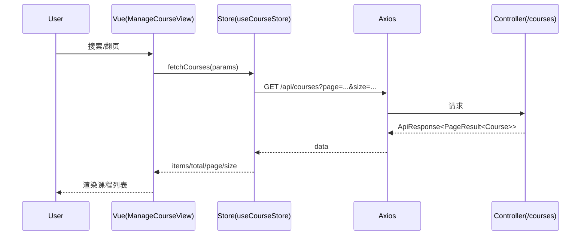

---

## 示例 3：AI 助手对话（POST /api/ai/chat）

- 后端接口：`POST /api/ai/chat`
  - 请求体（要点）：`messages[]`、可选 `conversationId`、可选 `studentIds[]`
  - 响应体：`{ code: 200, data: { answer, conversationId, messageId } }`
- 前端对应文件：
  - 请求封装：`src/api/ai.api.ts`（示例方法：`chat(payload)`）
  - Store：`src/stores/ai.ts`（示例 `useAiStore`）
    - 管理当前会话 ID、消息列表、loading 状态
  - 视图：`src/features/shared/views/AiAssistantView.vue`（或同名位置）
    - 输入框回车/点击发送 → 调用 `chat` → 渲染助手回答
- 验证要点：
  - 首次会话 `conversationId` 为空时，后端会新建会话并返回 ID
  - 后续轮次复用 `conversationId` 追加消息
  - 401 时应自动跳转到登录页（拦截器行为）

时序图：
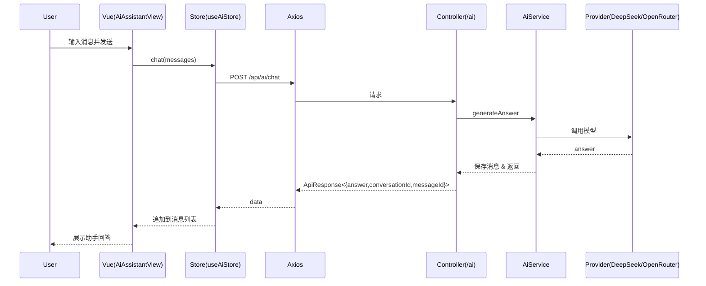

---

## 示例 4：通知流（GET /api/notifications 或轮询/流）

- 后端接口：`GET /api/notifications`（实际以后端为准）
- 前端对应文件：
  - 组合式函数：`src/composables/useNotificationStream.ts`
  - 组件：`src/components/notifications/NotificationBell.vue`、`NotificationCenter.vue`
  - Store：`src/stores/notifications.ts`
- 验证要点：
  - 新通知能被感知并高亮提示
  - 点击查看后变为已读

时序图：
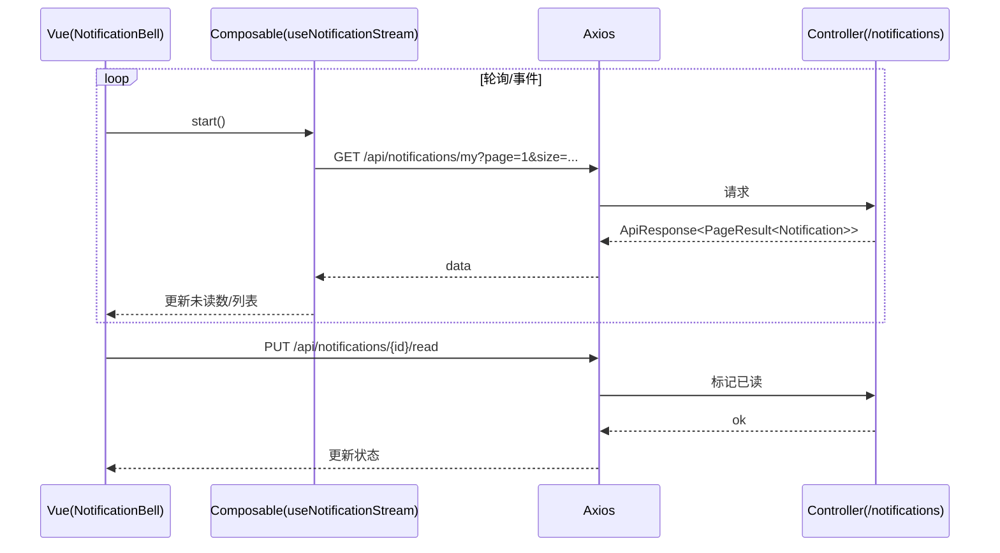

---

## 约定与类型对齐

- 统一响应：`{ code, message, data }`，业务成功 `code=200`
- 分页体 `PageResult<T>`：前端 Store 应保存 `items`、`total`、`page`、`size`
- TS 类型与后端 DTO 字段保持一致（`src/types/*`）

---

## 新增一个 E2E 功能的清单（Checklist）

1) 后端
   - 定义 DTO（request/response）
   - Controller 暴露端点，标注 Swagger 注解
   - Service 编写业务逻辑
   - Mapper + XML 实现数据访问
   - 在 Swagger 中验证通过
2) 前端
   - `src/types/` 增加/更新类型
   - `src/api/xxx.api.ts` 增加请求方法
   - `src/stores/xxx.ts` 增加 action/state/getters
   - 视图/组件联动 Store（加载/空态/异常态）
   - i18n 文案、路由守卫
3) 自测
   - 控制台无错误；网络请求参数/响应正确
   - 401/404/500 等异常路径有友好提示

---

## 快速排查指南
- 404：检查 URL（是否包含 `/api` 前缀）、代理与 Nginx 配置
- 401：token 是否在拦截器中附带；是否过期被清理
- 500：后端日志（`logs/application.log`）与异常栈
- 跨域：开发模式通过 Vite 代理 `/api`；生产需 Nginx 反代

---

## 示例 5：课程发布/下线（POST /api/courses/{id}/publish|unpublish）

- 前端：`ManageCourseView.vue` → `useCourseStore` → `course.api.ts`
- 后端：`CourseController` → `CourseService`

时序图：
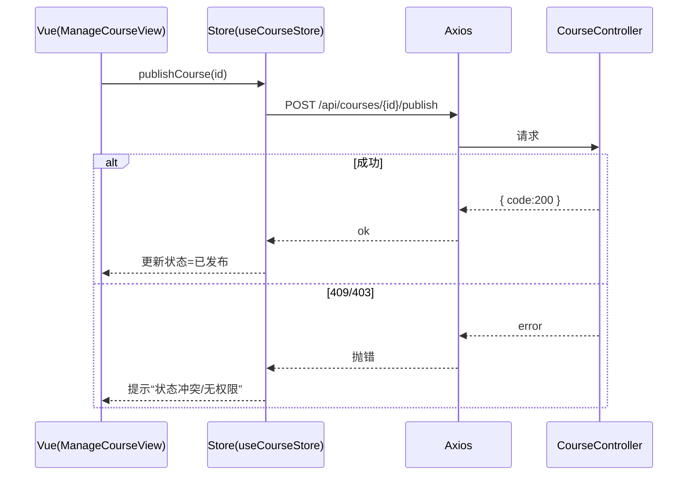

---

## 示例 6：师生绑定/解绑（teacher-student.api.ts）

- 前端：`TeacherStudentView.vue` → `useTeacherStore` → `teacher-student.api.ts`
- 后端：`TeacherStudentController`

时序图：
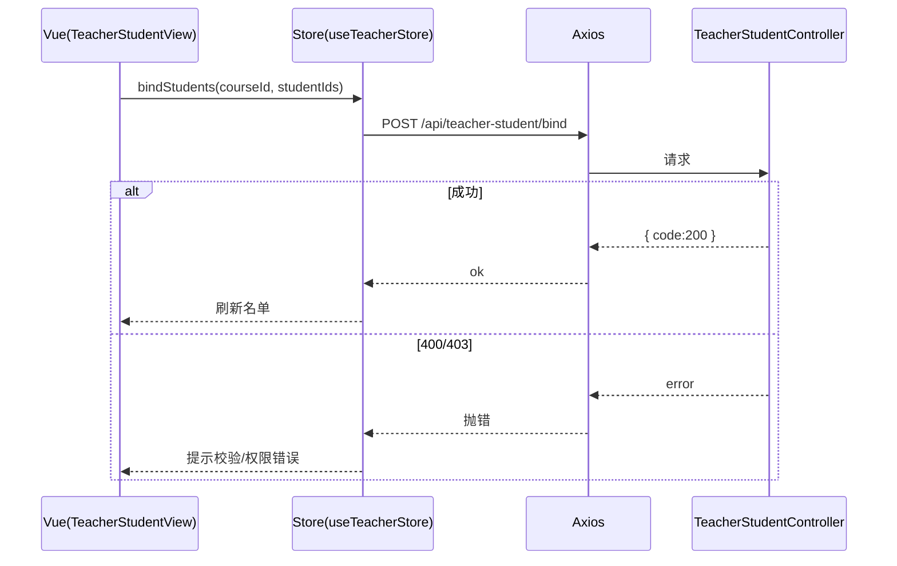

---

## 示例 7：课程详情加载（GET /api/courses/{id}）

- 前端：`CourseDetailView.vue` → `useCourseStore` → `course.api.ts`
- 后端：`CourseController`

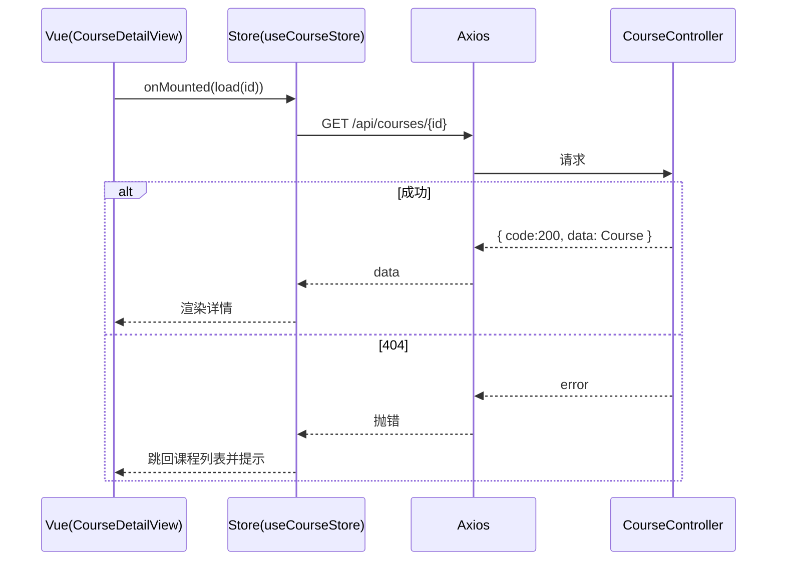

---

## 示例 8：成绩批改与发布（POST /api/grades → /api/grades/{id}/publish）

- 前端：`GradeAssignmentView.vue` → `useTeacherStore` → `grade.api.ts`
- 后端：`GradeController`

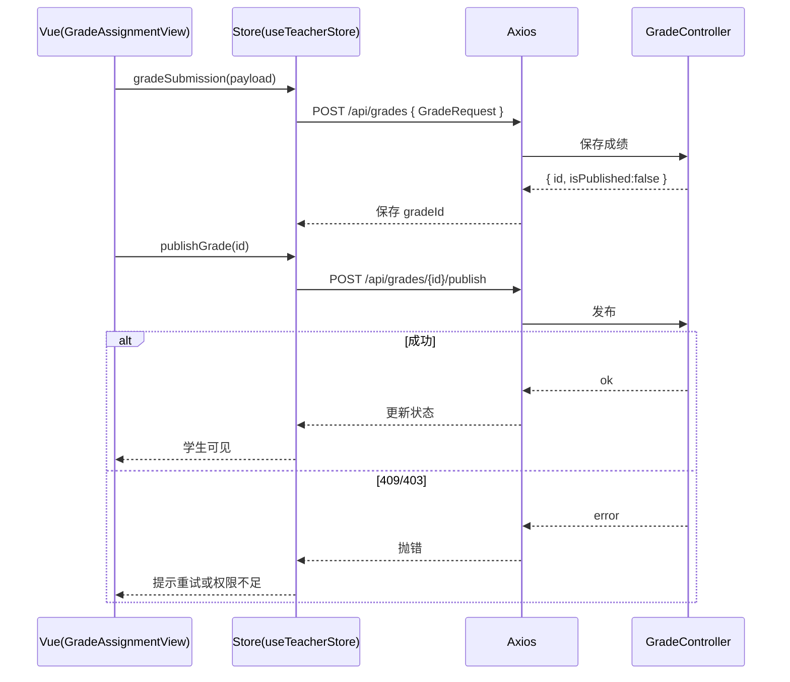

---

## 示例 9：作业列表与筛选（GET /api/assignments）

- 前端：`AssignmentListView.vue` → `useAssignmentStore` → `assignment.api.ts`
- 后端：`AssignmentController`

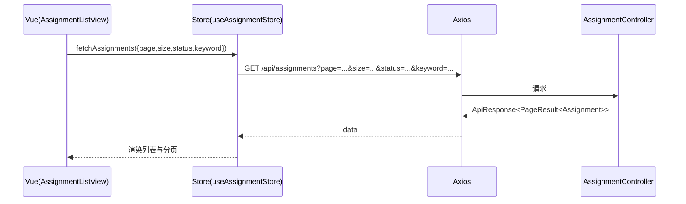

---

## 示例 10：通知中心标记已读/全部已读

- 前端：`NotificationCenter.vue` → `useNotificationStore` → `notification.api.ts`
- 后端：`NotificationController`

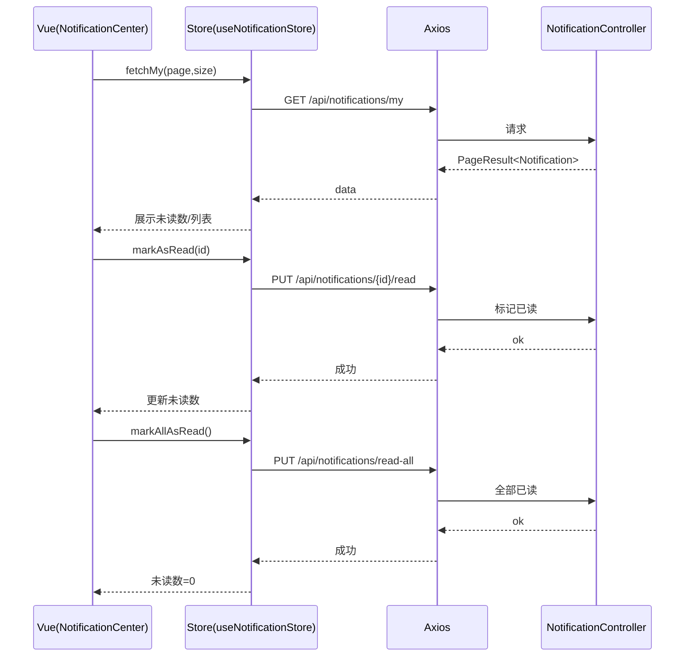

---

## 示例 11：文件上传与下载

- 前端：`FileManager.vue` → `useFileStore` → `file.api.ts`
- 后端：`FileController`

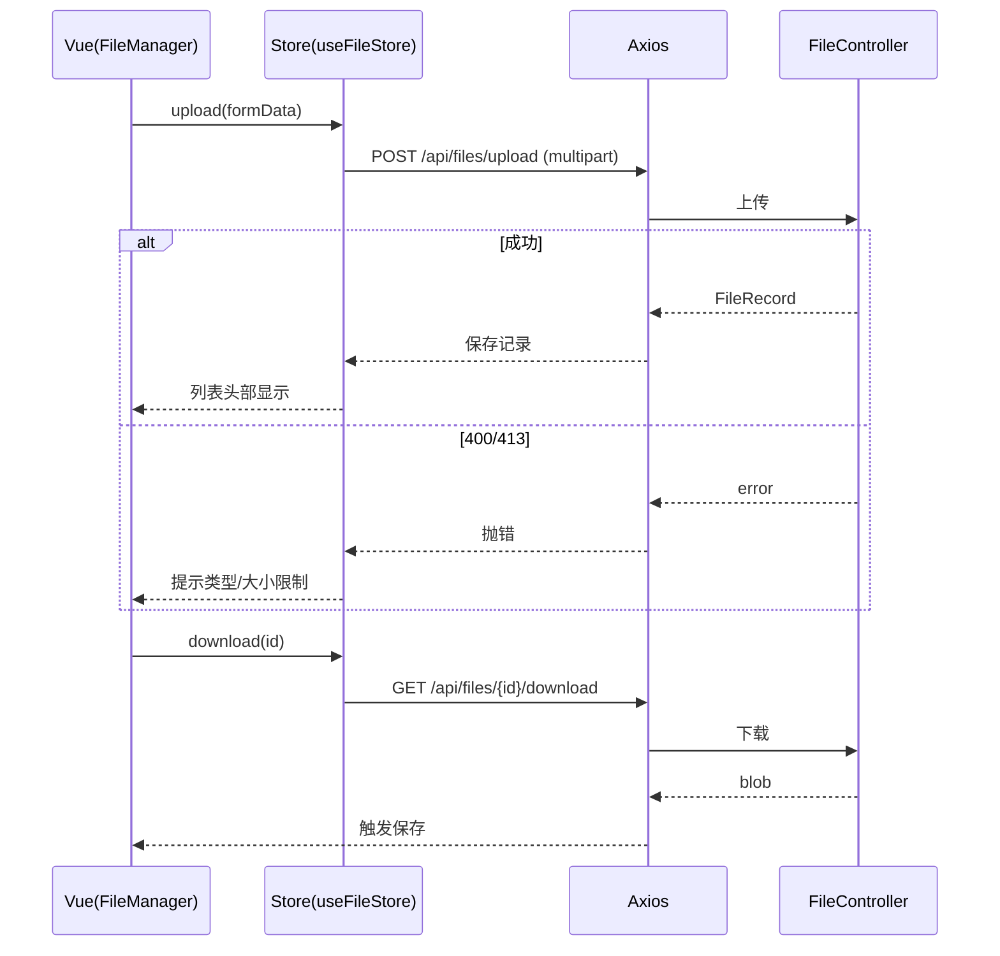

---

## 示例 12：课时进度异常重传（POST /api/lessons/{id}/progress）

- 前端：`LessonPlayer.vue` → `useLessonStore` → `lesson.api.ts`
- 后端：`LessonController`

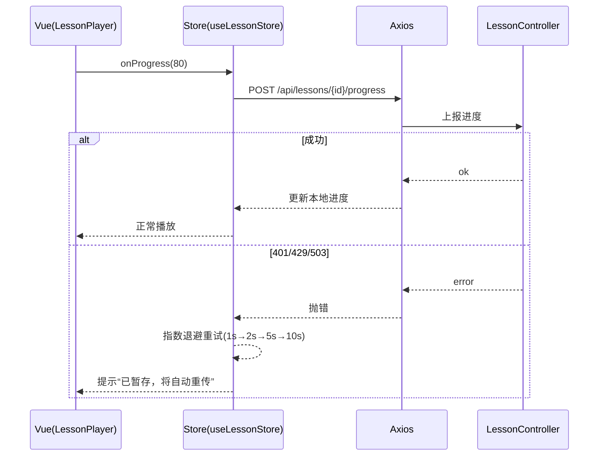

---

## 示例 13：社区发帖与评论（POST /api/community/posts, POST /api/community/posts/{id}/comments）

- 前端：`CommunityView.vue` → `useCommunityStore` → `community.api.ts`
- 后端：`CommunityController`

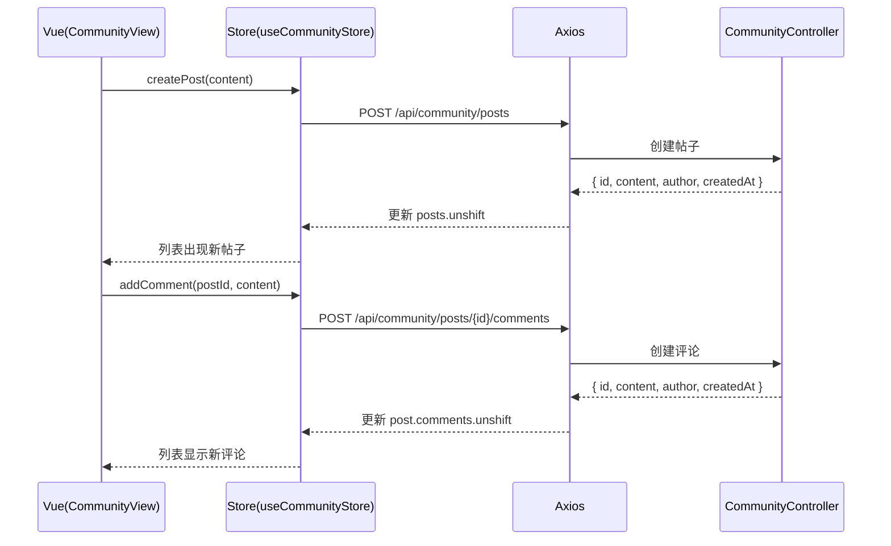

---

## 示例 14：教师仪表盘指标聚合（GET /api/teacher/dashboard）

- 前端：`DashboardView.vue` → `useDashboardStore` → `teacher.api.ts`
- 后端：`TeacherController`/`DashboardServiceImpl`

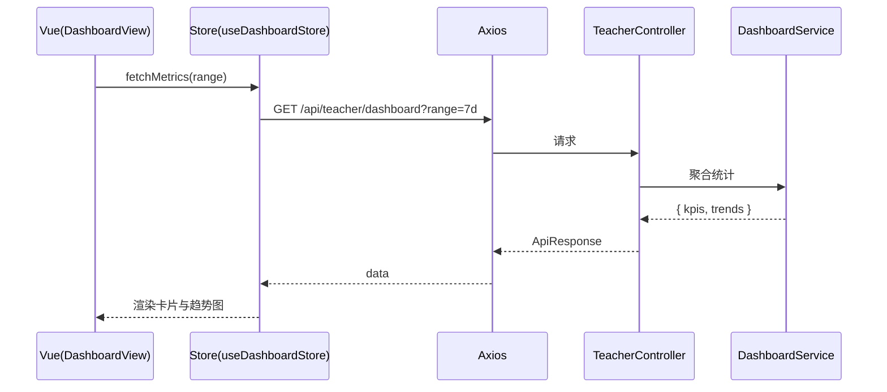

---

## 示例 15：学生能力雷达/趋势（GET /api/ability/student/{id}）

- 前端：`StudentAbilityView.vue` → `useStudentStore` → `ability.api.ts`
- 后端：`AbilityController`/相关服务

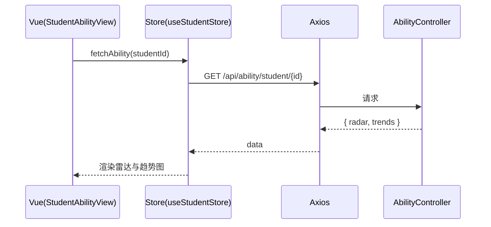
