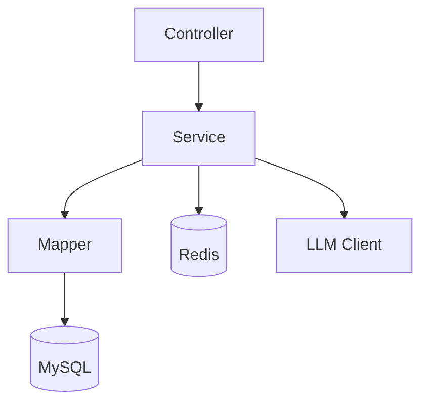
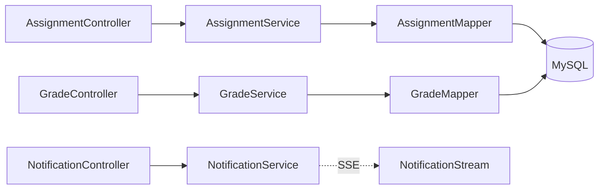

# 逐文件导览（File Walkthrough）

本章逐个讲清“关键文件做什么、谁在调用它、常见注意点”。

> 说明：并非全量列出所有文件；对同类文件（例如 DTO/类型）采用“批量描述 + 代表示例”的方式，降低理解门槛。

## 后端关键文件

### 1) `src/main/java/com/noncore/assessment/AssessmentApplication.java`
- 职责：应用入口；启用缓存与 Mapper 扫描；启动时打印 Swagger/健康检查地址
- 上游：`mvn spring-boot:run` 启动后由 JVM 调用 `main`
- 下游：Spring Boot 自动装配，加载 `config/*`、`controller/*` 等
- 注意：context-path 为 `/api`，Swagger 请访问 `/api/swagger-ui.html`

### 2) `controller/AiController.java`
- 职责：AI 聊天、会话、用户记忆的 REST 接口
- 上游：前端 `/api/ai/*` 请求
- 下游：`AiService`、`AiConversationService`、`AiMemoryService`
- 注意：需登录（`@PreAuthorize("isAuthenticated()")`）；统一返回 `ApiResponse`
- 调用链：`/ai/chat` → `AiService.generateAnswer` → `DeepseekClient`（或 provider）→ 记录消息 → 返回

### 3) `service/impl/StudentAnalysisServiceImpl.java`
- 职责：学生维度能力分析与指标聚合（示例）
- 上游：`DashboardService` 或相关 Controller 调用
- 下游：`AssignmentMapper`、`GradeMapper` 等
- 注意：
  - 分页/聚合边界条件（空数据、除零）
  - 时间窗口参数校验
  - 返回结构需与前端 `studentApi.getAnalysis` 对齐
- 调用链：Controller → `StudentAnalysisServiceImpl` → 多 Mapper 聚合 → 组装 KPI/Radar/Trends

### 4) `service/impl/CourseServiceImpl.java`
- 职责：课程全生命周期管理（创建、编辑、查询、关联）
- 上游：`CourseController`
- 下游：`CourseMapper`、`LessonMapper` 等
- 注意：
  - 权限边界（教师/学生/管理员），方法级鉴权
  - 状态流转（草稿→发布→下线），避免非法状态跳转
- 调用链：Controller → `CourseServiceImpl` → `CourseMapper` / `LessonMapper` → DB

### 5) `service/impl/DashboardServiceImpl.java`
- 职责：教学仪表盘指标汇总（完成率、分布、趋势）
- 上游：`DashboardController`
- 下游：多 Mapper 聚合
- 注意：查询窗口、时间粒度、缓存策略（可结合 Redis）
- 调用链：Controller → `DashboardServiceImpl` → 多 Mapper → 聚合返回

### 6) `service/llm/DeepseekClient.java`
- 职责：对接 LLM（OpenRouter/DeepSeek）生成回答
- 上游：`AiService`
- 下游：外部 HTTP API
- 注意：从环境变量读取 `OPENROUTER_API_KEY/DEEPSEEK_API_KEY`、`DEEPSEEK_MODEL`
- 调用链：`AiService.generateAnswer` → `DeepseekClient` → Provider → 返回文本

### 7) `util/JwtUtil.java`
- 职责：JWT 生成/解析/刷新、JTI 黑名单
- 上游：`JwtAuthenticationFilter`、`AuthController`
- 下游：`io.jsonwebtoken` 库
- 注意：时效、时区、刷新逻辑与黑名单一致性

### 8) `exception/GlobalExceptionHandler.java`
- 职责：统一异常转标准响应体
- 上游：全局
- 下游：`ApiResponse`
- 注意：区分业务异常与系统异常；记录关键信息便于排查

### 9) `resources/application.yml`
- 职责：全局配置（端口、context-path、数据源、Redis、JWT、上传、日志、SpringDoc、AI、CORS 放行）
- 注意：可由环境变量覆盖；生产环境请配置强随机的 `JWT_SECRET`

---

## 前端关键文件

### 1) `src/api/config.ts`
- 职责：Axios 客户端与拦截器；自动拼接 `/api`；401 重定向登录
- 上游：所有 `api/*.ts`
- 下游：后端 `/api/**` 接口
- 注意：开发模式会打印 baseURL；登录/注册请求不加旧 token

### 2) `src/router/index.ts`
- 职责：路由表与守卫（如鉴权）
- 上游：应用入口 `main.ts`
- 下游：各视图组件
- 注意：未登录访问受限页时跳转登录
- 调用链：路由进入 → 守卫检查会话 → 放行/重定向登录

### 3) `src/layouts/StudentLayout.vue`、`src/layouts/TeacherLayout.vue`
- 职责：页面骨架、导航、背景与主题
- 上游：路由渲染
- 下游：特定视图
- 注意：配合背景组件与 UI Store 控制开关

### 4) `src/composables/useNotificationStream.ts`
- 职责：通知流（轮询/流式）封装
- 上游：顶栏通知中心、页面级订阅
- 下游：通知 API／消息中心
- 注意：防抖/去重、错误重试与断网恢复

### 5) `src/stores/*`
- 职责：Pinia 全局状态与业务流程
- 上游：各视图组件
- 下游：`api/*` 请求
- 注意：保持“后端即真理”，避免在前端擅自造数据

### 6) `src/features/teacher/*`、`src/features/student/*`
- 职责：按角色/领域组织的页面与组件（学生端为 Beta）
- 注意：从页面可反查到 Store 与 API（见 README 页面地图与 docs E2E）

---

## 跨文件关系与易错点
- Controller ↔ Service：参数校验在 Controller；事务边界在 Service
- Service ↔ Mapper：尽量保持薄 Mapper，复杂逻辑放 Service；SQL 注意索引与 N+1
- 前端 API ↔ Store：API 仅封装请求；Store 组织状态、错误与节流
- 组件 ↔ Store：组件不直接调用后端；通过 Store 简化渲染逻辑

常见易错：
- context-path 忽略 `/api` 导致 404
- 未携带 Authorization 导致 401
- 大列表未分页导致卡顿
- ECharts 实例未销毁导致内存泄漏

---

## 后端模块依赖图


## 前端模块连接图
```mermaid
graph TD
  View[Vue Component] --> Store[Pinia Store]
  Store --> API[api/*.ts]
  API --> Backend[/api/**]
  View --> Router[Vue Router]
  View --> I18n[vue-i18n]
  View --> ECharts[ECharts]
```

---

## 跨文件关系图（后端）


## 跨文件关系图（前端）
```mermaid
graph LR
  View[AssignmentSubmitView.vue] --> Store[useSubmissionStore]
  Store --> API[submission.api.ts]
  API --> Axios[axios instance]
  Axios --> Backend[/api/submissions]
  Backend -.SSE.-> Stream[notifications/stream]
```

## 页面 → Store → API 快速索引（示例）
- 课程详情：`CourseDetailView.vue` → `useCourseStore` → `course.api.ts` → `CourseController`
- 作业提交：`AssignmentSubmitView.vue` → `useSubmissionStore` → `submission.api.ts` → `SubmissionController`
- 成绩批改：`GradeAssignmentView.vue` → `useTeacherStore` → `grade.api.ts` → `GradeController`
