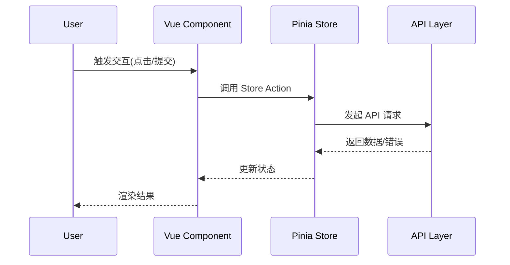

# 前端深度讲解（Frontend Deep Dive）

面向新手，带你理解目录结构、数据流与常见开发任务。

## 1. 环境与启动
- Node.js 18+（建议 20+）
- `npm install && npm run dev`
- `.env.development` 建议：`VITE_API_BASE_URL=http://localhost:8080`
- Axios 基址在开发模式会打印到控制台（见 `src/api/config.ts`）

## 2. 目录与职责
- `api/`：后端 Controller 的请求封装（`auth.api.ts`、`course.api.ts` 等）
- `stores/`：Pinia，全局状态与业务流程
- `features/`：按业务域/角色组织视图
- `layouts/`：`StudentLayout.vue`、`TeacherLayout.vue`
- `router/`：路由配置与守卫
- `types/`：与后端 DTO 对齐的 TS 类型
- `utils/`：工具方法（如统一 API 处理）
- `composables/`：组合式函数（如通知流 `useNotificationStream.ts`）

## 3. Axios 与鉴权
- 基址：优先读取 `VITE_API_BASE_URL`，自动拼接 `/api`；未设置走 `/api` 代理
- 请求拦截：除登录/注册外统一携带 `Authorization: Bearer <token>`
- 响应拦截：401 清理 token 并跳转登录

## 4. 全局数据流（从交互到渲染）


## 5. Store 与 API 映射
```mermaid
graph LR
  View --> Store
  Store --> API[api/*.ts]
  API --> Backend[/api/**]
```
- 约定：所有后端交互统一经由 `api/*.ts`，在 Store 聚合业务状态与副作用
- 好处：组件保持轻量；便于测试与复用

## 6. 错误处理模式
- 分类：
  - 401：清理会话并跳转登录
  - 403：提示无权限（不自动跳转）
  - 4xx：显示校验/业务错误信息
  - 5xx/网络：重试/降级，提示稍后再试
- 实践：
  - API 层尽量不捕获（除特殊需求，如 `teacher-student.api.ts` 对 400/403 兜底返回空列表）
  - Store 负责统一 toast/对话框提示与重试逻辑

## 7. i18n（中英双语）
- 所有新增文案需落在 `locales/zh-CN` 与 `locales/en-US`
- 组件中通过 `t('key')` 引用，避免硬编码
- 复杂句式优先在语言包拼接，减少组件逻辑

## 8. 组件-API 映射清单（开发 Checklist）
- 确认页面对应的 Store 名称与职责
- 列出页面所需的 API 方法（在 `api/*.ts` 明确）
- Store 中添加 action，处理装载/错误/分页等
- 组件引入 Store 并只关注 UI 与交互
- 新增文案同步 i18n
- 页面/Store/类型三者字段一致

## 9. 性能与可维护性建议
- 列表分页与防抖；避免重复请求
- 细粒度组件与 `defineProps/defineEmits` 明确契约
- 统一样式/组件库（/ui 目录）保证一致性
- ECharts 图表配置抽离复用（趋势/雷达/饼图风格统一）

## 10. 调试建议
- 使用浏览器开发者工具查看网络请求与 baseURL
- 若 404：检查后端 context-path `/api` 与前端环境变量
- 若跨域：开发模式应使用 Vite 代理 `/api` 到 `8080`
- 若样式异常：检查 Tailwind 与自定义样式作用域

---

## 11. 本次作业与通知重构要点

### 作业列表与详情（学生端）
- 视图：`features/student/views/AssignmentsView.vue`、`AssignmentSubmitView.vue`
- 列表：
  - 过滤区玻璃化（`GlassPopoverSelect`、搜索输入防抖 300ms）
  - 卡片化显示作业，多状态徽标，分页显示文案与下拉玻璃化
- 逻辑：`scheduled`（未来 `publishAt`）不展示；未提交过期显示 `late`（枚举采用小写，与后端 schema 对齐）
- 详情：
  - 教师附件（可下载）
  - 已评分显示“动态分数+进度条+等级+评分时间”玻璃卡
  - “教师评语/优点/可改进之处”按块级文本展示
  - 容错：当路由 `:id` 不是作业ID时，依次按“成绩ID→提交ID”反查 `assignmentId` 并重定向

### 通知详情跳转
- 视图：`features/shared/views/NotificationDetailView.vue`
- 解析顺序：
  1) `data.assignmentId`
  2) 若为成绩通知（grade/grade_posted）：使用 `gradeId` 请求成绩详情取 `assignmentId`
  3) `submissionId` → 调 `submissionApi.getSubmissionById` 反查 `assignmentId`
  4) 当且仅当 `relatedType=assignment` 时使用 `relatedId`
- 跳转：
  - 学生：`/student/assignments/:id/submit`
  - 教师：`/teacher/assignments/:id/submissions`

### 时间管理（教师端）
- 视图：`features/teacher/views/ReviewAssignmentView.vue`
- 支持 `draft/publish/scheduled`，使用 `GlassDateTimePicker` 选择精确到分钟，提供 +1d、+7d 等快捷按钮

### UI 组件标准化与玻璃化
- 新增：`GlassInput`、`GlassTextarea`、`GlassSearchInput`、`GlassDateTimePicker`
- 下拉：`GlassPopoverSelect` 修复定位（fixed + 监听滚动父元素 + 边界处理 + 可选 `teleport=false`）

### i18n 键新增/调整
- `student.assignments.detail.{attachmentsTitle,noAttachments,download,ungradedHint,notFoundTitle,notFoundMsg}`
- `student.grades.{level,strengths,improvements}`
- `student.assignments.status.late`

### 后端 Schema 与服务
- `schema.sql`：`assignments.status` 增 `'scheduled'`；新增 `publish_at timestamp NULL`；索引 `idx_publish_at`
- `GradeServiceImpl`：发布成绩自动触发 `NotificationServiceImpl.sendGradeNotification`
- `NotificationServiceImpl`：成绩通知的 `relatedType='assignment'`、`relatedId=assignmentId`，消息仅含“作业名+分数”

### 聊天抽屉与通知联动（历史条目）

- 最近会话改为服务端统一接口：`GET /api/chat/conversations/my`
  - `stores/chat.ts` 映射 `peerId/peerName/avatar/lastContent/unread/lastAt`
  - 学生端“最近”按 username 去重；置顶规则保持不变；本地缓存按用户隔离
- 通知详情页（`features/shared/views/NotificationDetailView.vue`）
  - 消息类通知点击“前往处理”打开聊天抽屉，且不改左侧最近预览
- 联系人加载
  - 学生端：`/students/courses/{id}/participants`（显示 username）
  - 教师端：优先 `/teachers/contacts`（分课程聚合），失败回退“我的课程 + 逐课学生”
- 表情选择器统一玻璃样式
  - `components/ui/EmojiPicker.vue` 与聊天抽屉内置选择器均为 v-glass，隐藏滚动条
- 通知铃未读数修复
  - `stores/notifications.ts` 兼容后端键名：`unreadCount/unread/count`、`totalCount/total/count`、`byType/typeDistribution`

### 个人档案页玻璃样式（最新）

- 页面：`features/shared/views/ProfileView.vue`
  - 个人信息、编辑资料、账号安全、修改密码四块大卡片改用 v-glass（rounded-xl）
  - 账号安全内两块小卡片（修改密码、邮箱验证）去掉纯色背景，改用 v-glass（thin）
