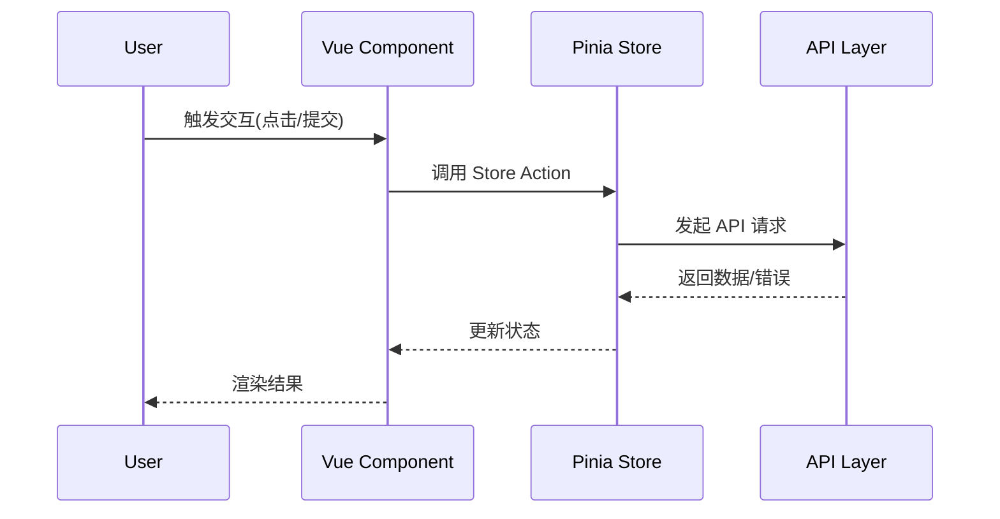

# 前端深度讲解（Frontend Deep Dive）

面向新手，带你理解目录结构、数据流与常见开发任务。

## 1. 环境与启动
- Node.js 18+（建议 20+）
- `npm install && npm run dev`
- `.env.development` 建议：`VITE_API_BASE_URL=http://localhost:8080`
- Axios 基址在开发模式会打印到控制台（见 `src/api/config.ts`）

## 2. 目录与职责
- `api/`：后端 Controller 的请求封装（`auth.api.ts`、`course.api.ts` 等）
- `stores/`：Pinia，全局状态与业务流程
- `features/`：按业务域/角色组织视图
- `layouts/`：`StudentLayout.vue`、`TeacherLayout.vue`
- `router/`：路由配置与守卫
- `types/`：与后端 DTO 对齐的 TS 类型
- `utils/`：工具方法（如统一 API 处理）
- `composables/`：组合式函数（如通知流 `useNotificationStream.ts`）

## 3. Axios 与鉴权
- 基址：优先读取 `VITE_API_BASE_URL`，自动拼接 `/api`；未设置走 `/api` 代理
- 请求拦截：除登录/注册外统一携带 `Authorization: Bearer <token>`
- 响应拦截：401 清理 token 并跳转登录

## 4. 全局数据流（从交互到渲染）


## 5. Store 与 API 映射
```mermaid
graph LR
  View --> Store
  Store --> API[api/*.ts]
  API --> Backend[/api/**]
```
- 约定：所有后端交互统一经由 `api/*.ts`，在 Store 聚合业务状态与副作用
- 好处：组件保持轻量；便于测试与复用

## 6. 错误处理模式
- 分类：
  - 401：清理会话并跳转登录
  - 403：提示无权限（不自动跳转）
  - 4xx：显示校验/业务错误信息
  - 5xx/网络：重试/降级，提示稍后再试
- 实践：
  - API 层尽量不捕获（除特殊需求，如 `teacher-student.api.ts` 对 400/403 兜底返回空列表）
  - Store 负责统一 toast/对话框提示与重试逻辑

## 7. i18n（中英双语）
- 所有新增文案需落在 `locales/zh-CN` 与 `locales/en-US`
- 组件中通过 `t('key')` 引用，避免硬编码
- 复杂句式优先在语言包拼接，减少组件逻辑

## 8. 组件-API 映射清单（开发 Checklist）
- 确认页面对应的 Store 名称与职责
- 列出页面所需的 API 方法（在 `api/*.ts` 明确）
- Store 中添加 action，处理装载/错误/分页等
- 组件引入 Store 并只关注 UI 与交互
- 新增文案同步 i18n
- 页面/Store/类型三者字段一致

## 9. 性能与可维护性建议
- 列表分页与防抖；避免重复请求
- 细粒度组件与 `defineProps/defineEmits` 明确契约
- 统一样式/组件库（/ui 目录）保证一致性
- ECharts 图表配置抽离复用（趋势/雷达/饼图风格统一）

## 10. 调试建议
- 使用浏览器开发者工具查看网络请求与 baseURL
- 若 404：检查后端 context-path `/api` 与前端环境变量
- 若跨域：开发模式应使用 Vite 代理 `/api` 到 `8080`
- 若样式异常：检查 Tailwind 与自定义样式作用域
