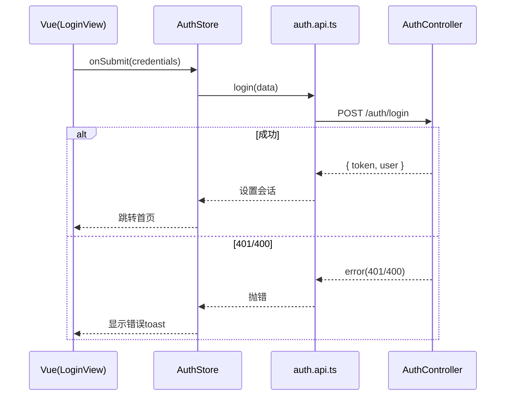
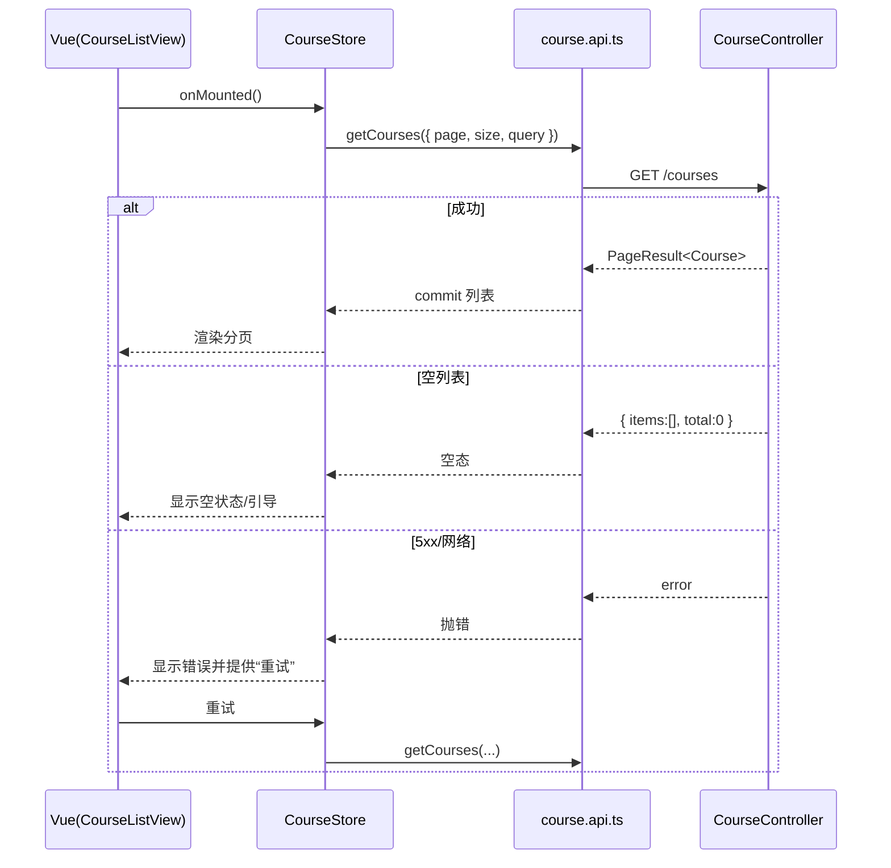
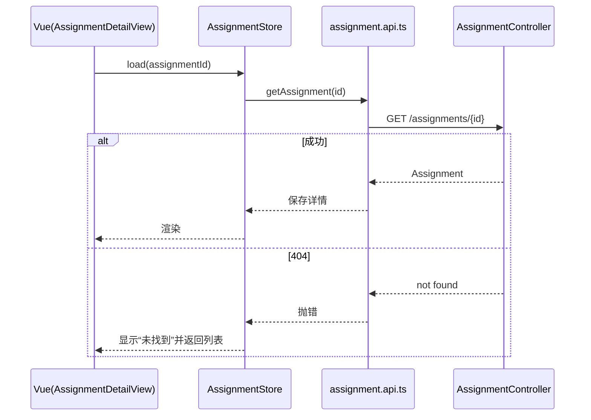
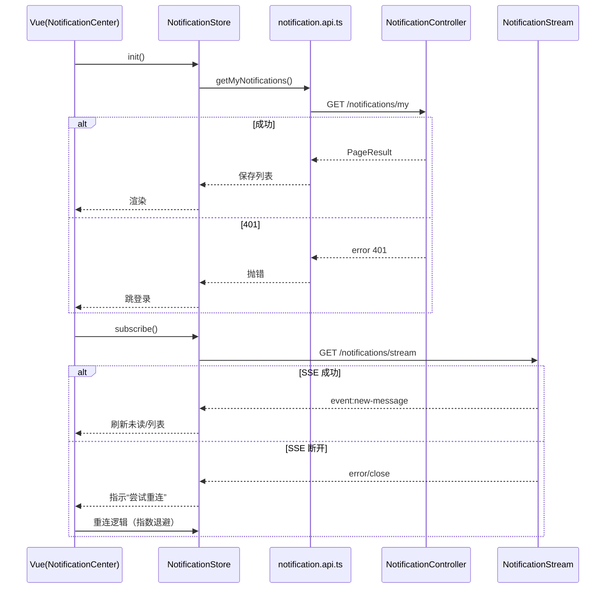
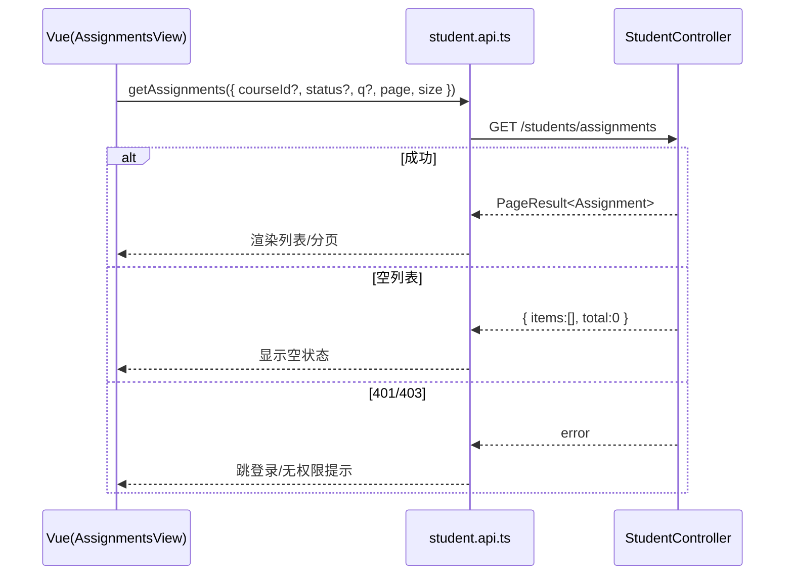
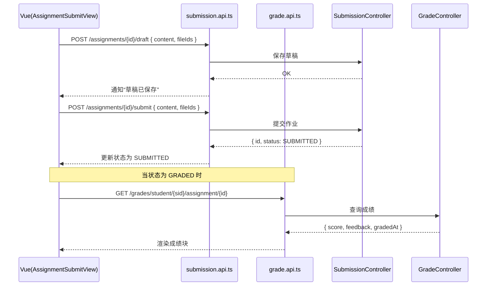
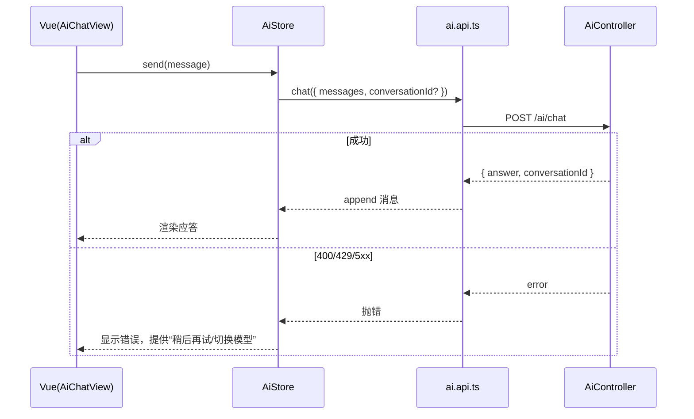
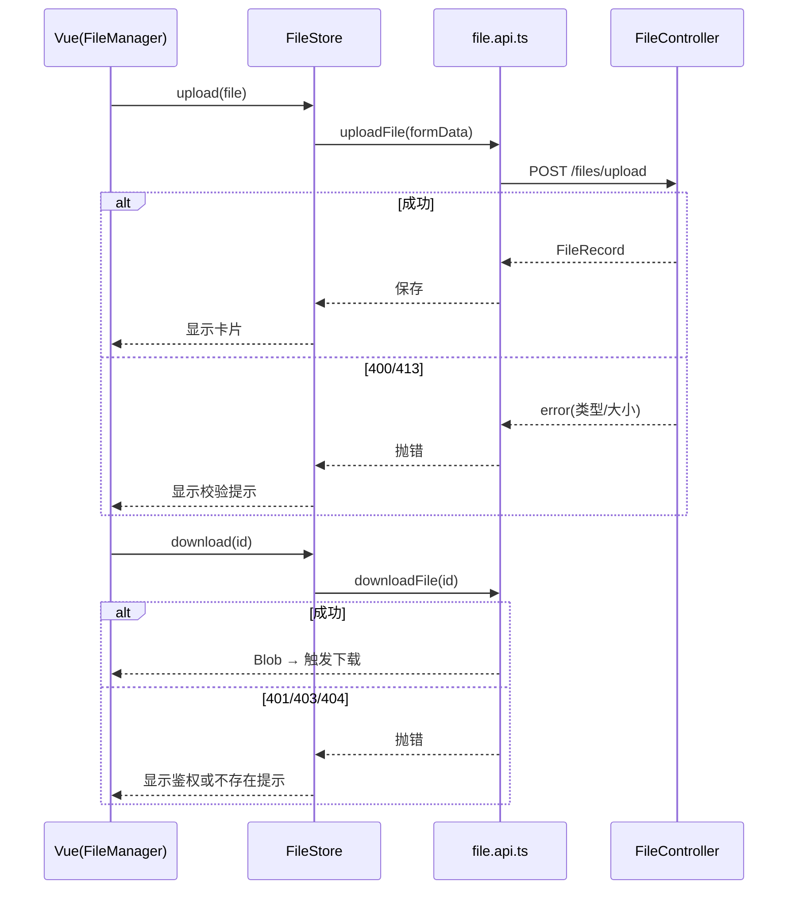
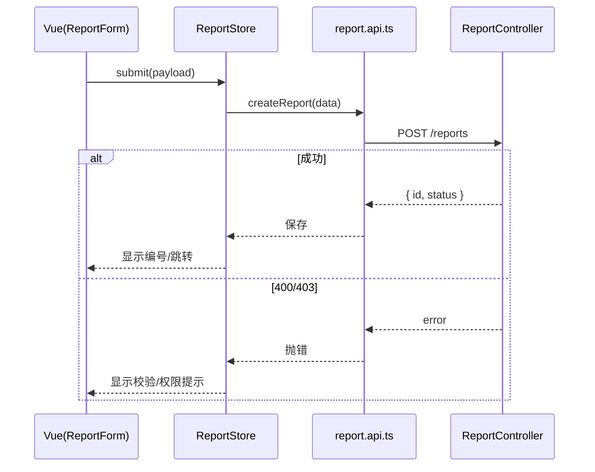
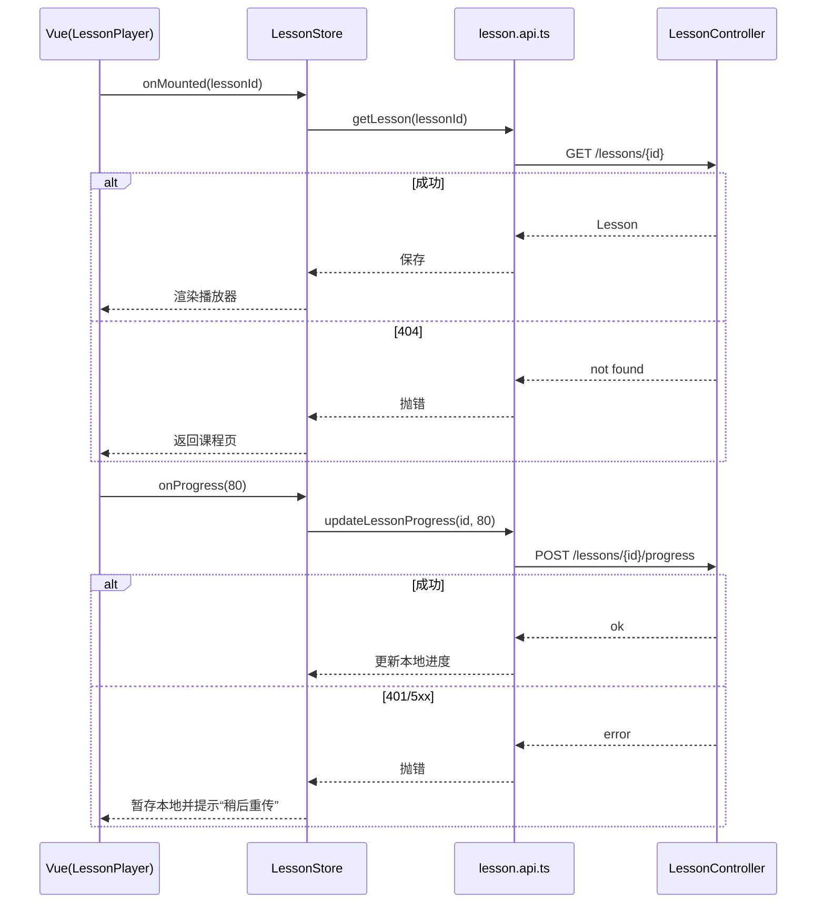

# 页面级时序图（Component ↔ Store ↔ API ↔ Backend）

> 用于快速理解关键页面从组件到后端的完整调用链。

## PageHeader 渲染时机
- 所有采用 PageHeader 的页面，会在组件模板初始化阶段立即渲染标题与副标题；右上角 actions 插槽里的筛选/按钮与后续数据加载并行。
- 建议：不要将需要后端返回的数据作为标题文本来源，标题文案走 i18n；动态数据只放在 actions 或主体区。

## 登录页（LoginView）

## 课程列表（CourseListView）

## 作业详情（AssignmentDetailView）

## 通知中心（NotificationCenter）

## 学生作业列表（AssignmentsView）

## 学生提交-草稿-评分展示（AssignmentSubmitView）

## AI 聊天（AiChatView）

## 文件管理（FileManagerView）

## 举报表单（ReportFormView）

## 学生课时进度（LessonPlayerView）

