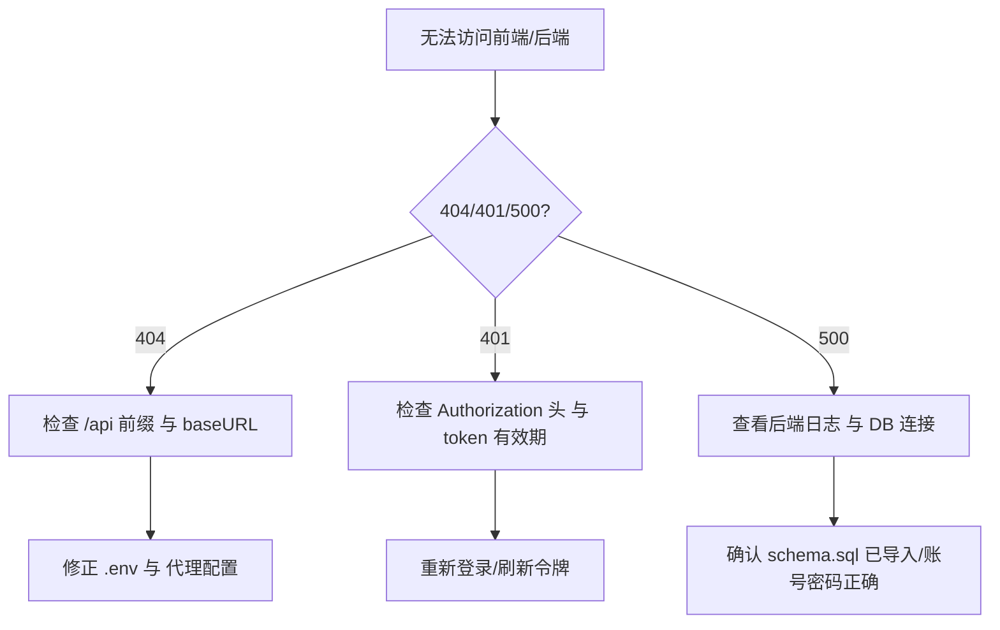

# 零基础快速上手（Beginner Quickstart）

目标：从 0 跑通项目（后端 + 前端），并能打开 Swagger 与页面。

## 0. 前置检查（Preflight Checks）
- Java 版本：`java -version` 输出 17.x
- Node 版本：`node -v` 输出 ≥ 18（建议 20）
- Maven：`mvn -v` 正常
- MySQL：能够登录；字符集为 `utf8mb4`
- 端口占用：8080（后端）、5173（前端）、4174（文档）未被占用

## 1. 安装必备工具
- Java 17（JDK） → 参考 `https://dev.java/`
- Node.js 18+（建议 20+） → 参考 `https://nodejs.org/`
- Maven 3.8+ → 参考 `https://maven.apache.org/`
- MySQL 8.x → 参考 `https://dev.mysql.com/`
- Redis 6.x（可选） → 参考 `https://redis.io/`

## 2. 初始化数据库
```bash
mysql -u root -p
CREATE DATABASE student_assessment_system CHARACTER SET utf8mb4 COLLATE utf8mb4_unicode_ci;
# 导入结构（最新）
mysql -u root -p student_assessment_system < backend/src/main/resources/schema.sql
# 可选：初始数据（当前非最新，导入前请自行核对）
mysql -u root -p student_assessment_system < backend/src/main/resources/data.sql
```

## 3. 启动后端
```bash
cd backend
mvn spring-boot:run
# 默认地址：http://localhost:8080/api
```
- Swagger：`http://localhost:8080/api/swagger-ui.html`
- 健康检查：控制台启动日志与 `/actuator/health`（如启用）

## 4. 启动前端
```bash
cd frontend
npm install
# 建议创建 .env.development 并设置：
# VITE_API_BASE_URL=http://localhost:8080
# （可选）若通过 Vite 代理：导出 VITE_BACKEND_URL=http://localhost:8080
npm run dev
# 默认地址：http://localhost:5173
```
- 控制台会打印 `Axios baseURL`

## 5. 文档站点（可选）
```bash
cd docs
npm install
npm run docs:dev
# 访问 http://localhost:4174
```
- 在应用内访问 `/docs` 时，若设置了 `VITE_DOCS_URL`，前端会直接跳转到该地址。
- 若 ESM 报错：`docs/package.json` 添加 `"type": "module"`
- 若首页 404：确保 `docs/index.md` 存在

## 6. 验证清单（Checklist）
- [ ] Swagger 可访问并能打开任意控制器
- [ ] 前端首页可访问，登录失败/成功均有清晰提示
- [ ] 前端请求命中 `/api`，无 CORS 报错
- [ ] 数据库连接成功，后端无启动异常
- [ ] （可选）SSE 订阅成功，通知能推送

## 7. 排错决策树（Troubleshooting）


## 8. 下一步计划（First Milestones）
- 里程碑 1（当天）：跑通后端、前端与 Swagger；记录本地配置
- 里程碑 2（第2天）：完成 `e2e-examples.md` 的登录/课程列表流程
- 里程碑 3（第3-4天）：完成 Cookbook 任一任务（建议“通知中心会话模式”）并提交 PR

> 继续阅读：`architecture-overview.md`（理解一次请求的完整链路）；`file-walkthrough.md`（关键文件与调用关系）。


